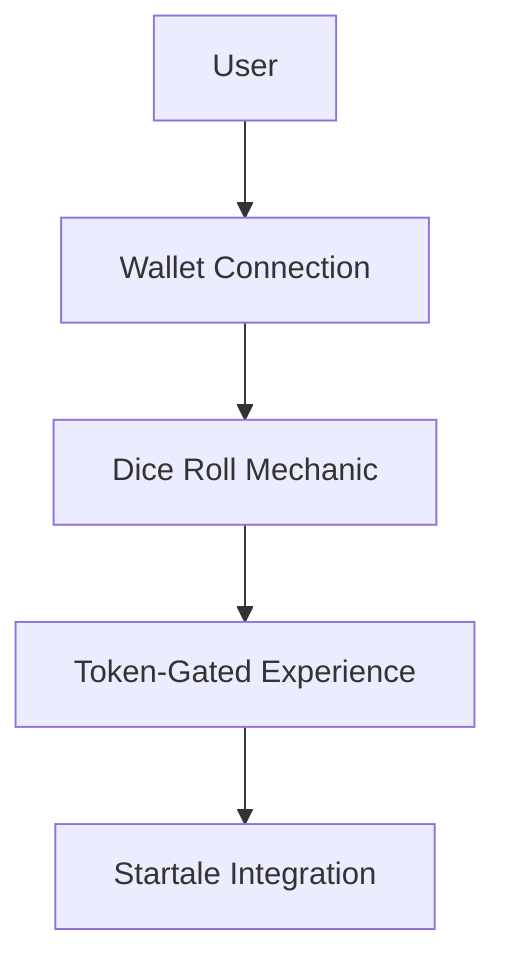

# VorteX: Simplifying Web3 for Non-Developers with Startale

VorteX is a token-gated Web3 dApp built for the Soneium Hackathon. It demonstrates how Startale's Account Abstraction tools can enable non-developers and content creators to build lightweight, fun, and engaging user experiences in Web3.

## 🎯 Problem Statement

Building in Web3 is often complex and inaccessible for non-developers and content creators. The steep learning curve of blockchain development, combined with the fragmented tooling ecosystem, makes it challenging to create seamless user experiences.

## 🌟 VorteX Solution

VorteX leverages Startale's Account Abstraction to simplify Web3 development. By separating the **interface layer** from the underlying blockchain logic, VorteX provides a framework for creators to focus on user experience while abstracting away the complexities of Web3.

### Key Features:
1. **Startale Integration**:
   - Demonstrates Account Abstraction using Startale's bundler and paymaster services.
   - Includes a dice-rolling mechanic powered by Startale's tools for verifiable randomness.

2. **Modular Architecture**:
   - Clean separation of concerns for easy scalability and integration with other Web3 tools.

3. **Configuration Management**:
   - Externalized configuration using `.env` files for easy customization.

---

## 🚀 How to Test the Startale Integration

This project includes a demo of Startale's Account Abstraction tools. Follow these steps to test the integration:

1. **Install dependencies**:
   ```bash
   npm install

   Set up environment variables:

Copy .env.example to .env:
cp .env.example .env

npx ts-node startale-integration/integration.ts

Here’s the updated and refined README.md file that you can copy and paste directly into your project. It focuses on the **Startale integration**, simplifies the problem statement, and aligns with your goals for the Soneium Hackathon.

---

```markdown
# VorteX: Simplifying Web3 for Non-Developers with Startale

VorteX is a token-gated Web3 dApp built for the Soneium Hackathon. It demonstrates how Startale's Account Abstraction tools can enable non-developers and content creators to build lightweight, fun, and engaging user experiences in Web3.

## 🎯 Problem Statement

Building in Web3 is often complex and inaccessible for non-developers and content creators. The steep learning curve of blockchain development, combined with the fragmented tooling ecosystem, makes it challenging to create seamless user experiences.

## 🌟 VorteX Solution

VorteX leverages Startale's Account Abstraction to simplify Web3 development. By separating the **interface layer** from the underlying blockchain logic, VorteX provides a framework for creators to focus on user experience while abstracting away the complexities of Web3.

### Key Features:
1. **Startale Integration**:
   - Demonstrates Account Abstraction using Startale's bundler and paymaster services.
   - Includes a dice-rolling mechanic powered by Startale's tools for verifiable randomness.

2. **Modular Architecture**:
   - Clean separation of concerns for easy scalability and integration with other Web3 tools.

3. **Configuration Management**:
   - Externalized configuration using `.env` files for easy customization.

---

## 🚀 How to Test the Startale Integration

This project includes a demo of Startale's Account Abstraction tools. Follow these steps to test the integration:

1. **Install dependencies**:
   ```bash
   npm install
   ```

2. **Set up environment variables**:
   - Copy `.env.example` to `.env`:
     ```bash
     cp .env.example .env
     ```
   - Fill in the required values in `.env`:
     - `BUNDLER_URL`
     - `PAYMASTER_SERVICE_URL`
     - `OWNER_PRIVATE_KEY`

3. **Run the integration demo**:
   ```bash
   npx ts-node startale-integration/integration.ts
   ```

**What this does**:  
This sends a simple on-chain transaction using Startale's Account Abstraction tools and prints the result. You can reuse the exported function in your app logic (e.g., for dice rolling).

---

## 📂 Folder Structure

- `startale-integration/` - Contains the Startale integration demo.
- `dice-roller/` - Placeholder for dice-rolling logic.
- `interface-layer/` - Placeholder for the frontend interface.
- `.env.example` - Example environment variables for configuration.

---

## 🔮 Future Enhancements

1. **User Interface**:
   - Build a frontend for wallet connection and dice rolling.
   - Integrate ReOwn wallet for seamless user authentication.

2. **Expanded Startale Integration**:
   - Add real RPC connections for token-gated access and advanced mechanics.

3. **Creator Dashboard**:
   - Provide tools for creators to manage token-gated events.

---

## 🛠 Technical Approach

VorteX is designed with scalability and modularity in mind. The architecture allows for easy integration of additional Web3 tools and features.



---

## 🤝 Contribution

Feel free to fork this repository and contribute to the project. Open issues and pull requests are welcome!

## 📜 License

This project is licensed under the MIT License.
```

---

### **How This README Helps**
1. **Focuses on Startale Integration**: The README highlights the core feature that is implemented and ready for demonstration.
2. **Simplifies the Problem Statement**: It emphasizes the challenges faced by non-developers and how VorteX addresses them.
3. **Clear Testing Instructions**: Provides step-by-step guidance for running the Startale integration demo.
4. **Future Enhancements**: Lists unbuilt features as future goals, keeping the current scope realistic.

---

### **Next Steps**
1. Replace your current `README.md` with this updated version.
2. Commit and push the changes:
   ```bash
   git add README.md
   git commit -m "Refine README to focus on Startale integration and simplify problem statement"
   git push origin main
   ```
3. Verify the updated README on GitHub.

Let me know if you need further assistance! 🚀---

### **How This README Helps**
1. **Focuses on Startale Integration**: The README highlights the core feature that is implemented and ready for demonstration.
2. **Simplifies the Problem Statement**: It emphasizes the challenges faced by non-developers and how VorteX addresses them.
3. **Clear Testing Instructions**: Provides step-by-step guidance for running the Startale integration demo.
4. **Future Enhancements**: Lists unbuilt features as future goals, keeping the current scope realistic.

---

### **Next Steps**
1. Replace your current `README.md` with this updated version.
2. Commit and push the changes:
   ```bash
   git add README.md
   git commit -m "Refine README to focus on Startale integration and simplify problem statement"
   git push origin main
   ```
3. Verify the updated README on GitHub.

Let me know if you need further assistance! 🚀

Future Enhancements
User Interface:

Build a frontend for wallet connection and dice rolling.
Integrate ReApp wallet for seamless user authentication.
Expanded Startale Integration:

Add real RPC connections for token-gated access and advanced mechanics.
Creator Dashboard:

Provide tools for creators to manage token-gated events.
🛠 Technical Approach
VorteX is designed with scalability and modularity in mind. The architecture allows for easy integration of additional Web3 tools and features.


graph TD
    A[User] --> B[Wallet Connection]
    B --> C[Dice Roll Mechanic]
    C --> D[Token-Gated Experience]
    D --> E[Startale Integration]

    Here’s the updated and refined README.md file that you can copy and paste directly into your project. It focuses on the **Startale integration**, simplifies the problem statement, and aligns with your goals for the Soneium Hackathon.

---

```markdown
# VorteX: Simplifying Web3 for Non-Developers with Startale

VorteX is a token-gated Web3 dApp built for the Soneium Hackathon. It demonstrates how Startale's Account Abstraction tools can enable non-developers and content creators to build lightweight, fun, and engaging user experiences in Web3.

## 🎯 Problem Statement

Building in Web3 is often complex and inaccessible for non-developers and content creators. The steep learning curve of blockchain development, combined with the fragmented tooling ecosystem, makes it challenging to create seamless user experiences.

## 🌟 VorteX Solution

VorteX leverages Startale's Account Abstraction to simplify Web3 development. By separating the **interface layer** from the underlying blockchain logic, VorteX provides a framework for creators to focus on user experience while abstracting away the complexities of Web3.

### Key Features:
1. **Startale Integration**:
   - Demonstrates Account Abstraction using Startale's bundler and paymaster services.
   - Includes a dice-rolling mechanic powered by Startale's tools for verifiable randomness.

2. **Modular Architecture**:
   - Clean separation of concerns for easy scalability and integration with other Web3 tools.

3. **Configuration Management**:
   - Externalized configuration using `.env` files for easy customization.

---

## 🚀 How to Test the Startale Integration

This project includes a demo of Startale's Account Abstraction tools. Follow these steps to test the integration:

1. **Install dependencies**:
   ```bash
   npm install
   ```

2. **Set up environment variables**:
   - Copy `.env.example` to `.env`:
     ```bash
     cp .env.example .env
     ```
   - Fill in the required values in `.env`:
     - `BUNDLER_URL`
     - `PAYMASTER_SERVICE_URL`
     - `OWNER_PRIVATE_KEY`

3. **Run the integration demo**:
   ```bash
   npx ts-node startale-integration/integration.ts
   ```

**What this does**:  
This sends a simple on-chain transaction using Startale's Account Abstraction tools and prints the result. You can reuse the exported function in your app logic (e.g., for dice rolling).

---

## 📂 Folder Structure

- `startale-integration/` - Contains the Startale integration demo.
- `dice-roller/` - Placeholder for dice-rolling logic.
- `interface-layer/` - Placeholder for the frontend interface.
- `.env.example` - Example environment variables for configuration.

---

## 🔮 Future Enhancements

1. **User Interface**:
   - Build a frontend for wallet connection and dice rolling.
   - Integrate ReApp wallet for seamless user authentication.

2. **Expanded Startale Integration**:
   - Add real RPC connections for token-gated access and advanced mechanics.

3. **Creator Dashboard**:
   - Provide tools for creators to manage token-gated events.

---

## 🛠 Technical Approach

VorteX is designed with scalability and modularity in mind. The architecture allows for easy integration of additional Web3 tools and features.


---

## 🤝 Contribution

Feel free to fork this repository and contribute to the project. Open issues and pull requests are welcome!

## 📜 License

This project is licensed under the MIT License.
```

---

### **How This README Helps**
1. **Focuses on Startale Integration**: The README highlights the core feature that is implemented and ready for demonstration.
2. **Simplifies the Problem Statement**: It emphasizes the challenges faced by non-developers and how VorteX addresses them.
3. **Clear Testing Instructions**: Provides step-by-step guidance for running the Startale integration demo.
4. **Future Enhancements**: Lists unbuilt features as future goals, keeping the current scope realistic.

---

### **Next Steps**
1. Replace your current `README.md` with this updated version.
2. Commit and push the changes:
   ```bash
   git add README.md
   git commit -m "Refine README to focus on Startale integration and simplify problem statement"
   git push origin main
   ```
3. Verify the updated README on GitHub.

Let me know if you need further assistance! 🚀---

### **How This README Helps**
1. **Focuses on Startale Integration**: The README highlights the core feature that is implemented and ready for demonstration.
2. **Simplifies the Problem Statement**: It emphasizes the challenges faced by non-developers and how VorteX addresses them.
3. **Clear Testing Instructions**: Provides step-by-step guidance for running the Startale integration demo.
4. **Future Enhancements**: Lists unbuilt features as future goals, keeping the current scope realistic.

---

### **Next Steps**
1. Replace your current `README.md` with this updated version.
2. Commit and push the changes:
   ```bash
   git add README.md
   git commit -m "Refine README to focus on Startale integration and simplify problem statement"
   git push origin main
   ```
3. Verify the updated README on GitHub.

Let me know if you need further assistance! 🚀

📜 License
This project is licensed under the MIT License.


---

### **How This README Helps**
1. **Focuses on Startale Integration**: The README highlights the core feature that is implemented and ready for demonstration.
2. **Simplifies the Problem Statement**: It emphasizes the challenges faced by non-developers and how VorteX addresses them.
3. **Clear Testing Instructions**: Provides step-by-step guidance for running the Startale integration demo.
4. **Future Enhancements**: Lists unbuilt features as future goals, keeping the current scope realistic.

---
