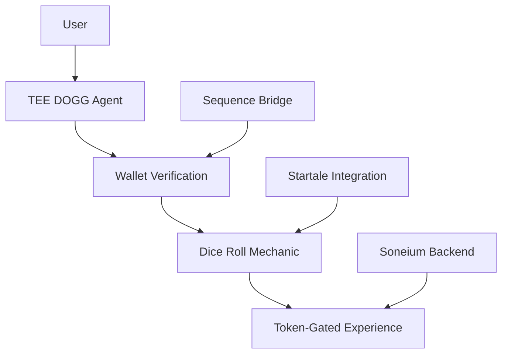

# VorteX: Token-Gated Cultural Experiences on Soneium

A token-gated Web3 dApp for the Soneium Hackathon that uses AI agent dialogue, audio immersion, and on-chain mechanics for access gating.

## 🎭 Vision & Problem Statement

VorteX addresses a critical challenge for cultural event creators: how to monetize digital experiences while maintaining creative control and building direct relationships with audiences.

Inspired by the Vortex techno event series, this project creates a framework for token-gated cultural experiences that leverage Soneium's sonic asset capabilities to create new monetization models for creators.

## 🏆 Why VorteX Matters for Soneium

Soneium's focus on sonic assets and cultural experiences makes it the ideal platform for VorteX:

1. **Cultural Experience Monetization**: VorteX demonstrates how Soneium can power new business models for event creators
2. **Sonic Asset Utilization**: The project leverages Soneium's unique capabilities for audio-based NFTs and experiences
3. **Community Building**: TEE DOGG agent creates engaging interactions that build community around cultural experiences
4. **Gamified Engagement**: The dice roll mechanic shows how randomness can create compelling user journeys on Soneium

## 🚀 Progress for Hackathon Judges

This project demonstrates a modular architecture for a token-gated Web3 dApp with the following key components:

### Core Architecture (Implemented)
- ✅ **Modular Component Structure**: Clean separation of concerns with well-defined interfaces
- ✅ **Documentation**: Comprehensive technical documentation and roadmap
- ✅ **Configuration Management**: Externalized configuration for easy customization
- ✅ **State Management**: Singleton pattern for consistent application state

### Sequence Integration (Partially Implemented)
- ✅ **Wallet Connection Structure**: Framework for connecting to Sequence wallet
- ✅ **Mock NFT Verification**: Structure for token-gated access control
- 🔄 **State Persistence**: Local storage-based state persistence
- 📝 **Real SDK Integration**: Planned activation of actual Sequence SDK

### Startale Integration (Partially Implemented)
- ✅ **Configuration Structure**: Framework for Startale RPC endpoints and contract addresses
- ✅ **Mock Dice Roller**: Client-side simulation of dice rolling
- ✅ **Integration Points**: Clear interfaces for connecting to real Startale RPC
- 📝 **Real RPC Connection**: Planned activation of actual Startale endpoints

### User Interface (In Progress)
- 🔄 **Basic UI Components**: Simple interface elements for wallet connection
- 🔄 **HTMX Integration Points**: Structure for declarative UI interactions
- 📝 **TEE DOGG Agent UI**: Planned implementation of AI bouncer interface

## 🔧 Technical Approach

VorteX takes an architecture-first approach, creating a solid foundation that can scale to support complex cultural experiences:



### Key Technical Components

1. **Sequence Bridge**: Wallet connection and NFT verification
2. **Startale Integration**: Verifiable randomness for dice rolling
3. **State Management**: Singleton pattern for consistent application state
4. **Interface Layer**: Flexible UI that can embed different experiences
5. **TEE DOGG Agent**: AI bouncer that controls access and guides users

## 📊 Current Implementation Status

VorteX is currently at the architectural proof-of-concept stage:

- ✅ **Complete Architecture**: Component boundaries, interfaces, and data flows defined
- ✅ **State Management**: Implemented singleton pattern with localStorage persistence
- ✅ **Mock Wallet Integration**: Functional wallet connection UI with mock implementation
- ✅ **Mock NFT Verification**: Structure for token-gated access
- ✅ **Startale Integration Structure**: Configuration and integration points for RPC
- 🔄 **Interface Layer**: Basic implementation with HTMX integration points
- 📝 **Soneium Deployment**: Prepared for deployment with configuration points

## 🚀 How to Run (Local Dev)

```bash
# Install dependencies
npm install

# Run locally
npm start
```

OR use Docker:

```bash
docker build -t vortex-access .
docker run -p 3000:80 vortex-access
```

## 🗂 Folder Structure Overview
- `app/` – Frontend UI and entry point
- `tee-dogg/` – Agent logic and dialogue
- `sequence-bridge/` – Wallet connection and NFT verification
- `dice-roller/` – Dice rolling logic
- `startale-integration/` - Startale RPC integration
- `interface-layer/` - Scene and interaction logic
- `docs/` - Comprehensive project documentation

## 📚 Documentation

Comprehensive documentation is available in the `docs/` directory:

- [**Architecture**](docs/ARCHITECTURE.md) - System design and component relationships
- [**Roadmap**](docs/ROADMAP.md) - Development timeline and milestones
- [**Technical Vision**](docs/TECHNICAL-VISION.md) - Long-term technical goals
- [**User Experience**](docs/USER-EXPERIENCE.md) - User journey and interaction design
- [**Current Status**](docs/CURRENT-STATUS.md) - Candid assessment of project state
- [**HTMX Documentation**](docs/HTMX-DOCUMENTATION.md) - Detailed explanation of HTMX usage

## 🎲 Startale Integration

The project includes a structured integration with Startale:

1. **Configuration**: `startale-integration/startale-config.js` contains placeholders for RPC URL and contract address
2. **Mock Implementation**: `startale-integration/startale-dice-roller.js` provides a mock implementation with toggle for real integration
3. **Integration Points**: Clear interfaces for connecting to the real Startale RPC

To activate real Startale integration:
1. Update the RPC URL and contract address in `startale-config.js`
2. Set the `useStartale` parameter to `true` when calling `rollDiceOnChain`

## 🔗 Sequence Integration

The project includes a structured integration with Sequence:

1. **Wallet Connection**: `sequence-bridge/index.js` provides wallet connection functionality
2. **State Management**: `sequence-bridge/state.js` implements a singleton state manager
3. **NFT Verification**: `sequence-bridge/marketplace.js` contains mock NFT verification logic

To activate real Sequence integration:
1. Uncomment the Sequence SDK imports in `sequence-bridge/index.js`
2. Replace mock implementations with real SDK calls

## 🔮 Future Development

With additional resources, VorteX will expand to include:

1. **Full Soneium Integration**: Connect to Soneium's infrastructure for sonic assets
2. **Real Blockchain Integration**: Replace mock implementations with actual Sequence and Startale connections
3. **Enhanced TEE DOGG Agent**: More sophisticated dialogue and interaction patterns
4. **Multiple Experience Types**: Support for various cultural experience formats
5. **Creator Dashboard**: Tools for cultural creators to manage their experiences

## 🧾 Contributors
- @radioclone
- @wentelteefje
- @0xcrackedlabs

## 🔍 Judging Considerations

When evaluating VorteX, please consider:

1. **Architectural Quality**: The clean separation of concerns and modular design
2. **Soneium Alignment**: How the project leverages Soneium's unique capabilities
3. **Problem-Solution Fit**: How effectively VorteX addresses creator monetization challenges
4. **Technical Foundation**: The solid foundation for future development
5. **Vision & Potential**: The long-term impact this approach could have for creators

## ⚠️ Intellectual Property Notice

This project is an experimental implementation inspired by "Vortex," a techno event series. This implementation explores the concept of programmable IP and monetization for original content creators through AI Agents and Onchain Economy.

The code implementation is provided for educational and experimental purposes only.

---

### 🧰 📦 Future Architecture Considerations (Post-Hackathon)

While this submission is optimized for rapid development and modular experimentation, the following architecture extensions are under consideration:

#### 🐳 Containerization Plan
- Future modules (e.g., **voice synthesis**, **NFT verification APIs**, or **Supabase-backed logic**) can be packaged into **independent Docker containers**
- This allows clean separation of logic, creative tooling, and real-time backends across services

#### 🔧 Frontend Scalability
- Current structure uses **vanilla HTML + HTMX + JS** to minimize friction and optimize creative flexibility
- A future **Vite-based Remix/Next.js UI layer** may be introduced to support:
  - Authenticated dashboards
  - Marketplace integrations
  - Wallet session management
- This will remain isolated from the creative layer to avoid introducing architectural bottlenecks prematurely

#### 🎮 Dynamic Scene Embedding
- The interface layer is built to support **interactive visual frameworks**, such as:
  - **Unity3D**
  - **Godot**
  - **Interactive Interface Module**
  - or any future custom renderer
- These will communicate with the main app using postMessage or local socket bridge and can be containerized independently
