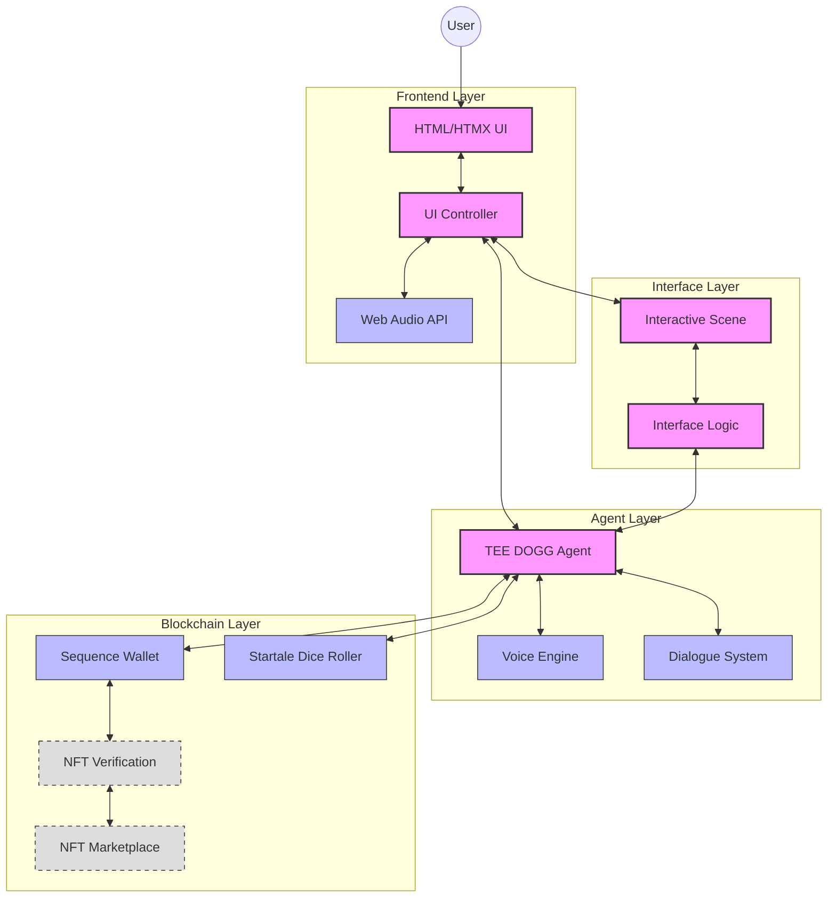

# VorteX System Architecture

This document outlines the architectural design of the VorteX token-gated Web3 dApp, explaining component relationships, data flows, and integration points.

## System Architecture Diagram

## Component Descriptions

### Frontend Layer

| Component | Description | Status |
|-----------|-------------|--------|
| **HTML/HTMX UI** | User interface built with HTML and enhanced with HTMX for dynamic interactions without heavy JavaScript | Placeholder structure |
| **Web Audio API** | Handles all audio experiences including voice, ambient sounds, music, and UI feedback | Planned |
| **UI Controller** | Manages UI state and coordinates between user interactions and system responses | Placeholder structure |

### Interface Layer

| Component | Description | Status |
|-----------|-------------|--------|
| **Interactive Scene** | Visual representation of the VorteX environment, potentially using WebGL or embedded frameworks | Basic structure |
| **Interface Logic** | Handles communication between the scene and other system components | Basic structure |

### Agent Layer

| Component | Description | Status |
|-----------|-------------|--------|
| **TEE DOGG Agent** | AI bouncer that controls access to the VorteX experience | Placeholder structure |
| **Voice Engine** | Processes and delivers TEE DOGG's voice and other character audio | Planned |
| **Dialogue System** | Manages conversation flows and responses based on user interactions | Planned |

### Blockchain Layer

| Component | Description | Status |
|-----------|-------------|--------|
| **Sequence Wallet** | Handles wallet connection and authentication | Planned |
| **NFT Verification** | Verifies ownership of required NFTs for access | Future |
| **Startale Dice Roller** | Provides verifiable randomness for in-experience interactions | Placeholder structure |
| **NFT Marketplace** | Integration point for NFT purchasing and trading | Future |

## Data Flow

1. **User Authentication Flow**
   - User connects wallet through Sequence
   - System verifies NFT ownership
   - Access granted or denied based on verification

2. **Interaction Flow**
   - User interacts with UI elements
   - HTMX handles dynamic content updates
   - Web Audio API provides responsive audio feedback
   - TEE DOGG agent responds based on interaction context

3. **Dice Rolling Flow**
   - User or system triggers dice roll
   - Request sent to Startale Dice Roller
   - Result returned and displayed
   - Outcome affects experience state

## Integration Points

### External Services

| Service | Integration Method | Status |
|---------|-------------------|--------|
| **Sequence Wallet** | JavaScript SDK | Planned |
| **Startale RPC** | API Calls via ethers.js | Planned |
| **NFT Marketplaces** | API Integration | Future |

### Internal Integration

- **Event-based Communication**: Components communicate through a centralized event system
- **State Management**: Shared state objects for maintaining consistency across components
- **Module Pattern**: Clean separation of concerns with well-defined interfaces between modules

## Technology Choices

### HTMX Selection Rationale

HTMX was selected for the frontend implementation for several key reasons:

1. **Reduced JavaScript Complexity**: Allows for dynamic UI updates without complex JavaScript frameworks
2. **HTML-Centric Development**: Keeps the focus on HTML structure with minimal JavaScript
3. **Progressive Enhancement**: Provides a solid baseline experience with enhanced functionality where available
4. **Lightweight Footprint**: Minimal impact on load times and performance
5. **Server-Side Rendering Compatibility**: Works well with server-rendered content if needed in future iterations

### Web Audio API Rationale

The Web Audio API was chosen for audio implementation because:

1. **Precise Timing Control**: Essential for synchronized audio experiences
2. **Audio Processing Capabilities**: Allows for real-time effects and modifications
3. **Multiple Audio Layer Management**: Supports separate control of voice, ambient, music, and UI audio
4. **Cross-Browser Compatibility**: Consistent implementation across modern browsers
5. **Performance Optimization**: Efficient handling of multiple audio sources

## Scalability Considerations

The architecture is designed with scalability in mind:

1. **Modular Components**: Each component can be independently scaled or replaced
2. **Containerization Ready**: Structure supports Docker containerization for deployment
3. **Service Isolation**: Clear boundaries between services allow for independent scaling
4. **Stateless Design**: Core components designed to be stateless where possible
5. **Asynchronous Communication**: Non-blocking operations for improved performance under load

## Security Considerations

1. **Client-Side Security**: Minimal sensitive operations on client side
2. **Wallet Connection**: Standard security practices for wallet connections
3. **API Security**: Planned implementation of proper authentication for any future APIs
4. **Data Validation**: Input validation at all entry points

## Future Architectural Expansion

The architecture is designed to accommodate future expansions:

1. **LLM Integration**: Architecture supports replacing rule-based dialogue with LLM-powered conversations
2. **Multi-User Experiences**: Structure can be extended to support multi-user interactions
3. **Enhanced Visualization**: Interface layer can be upgraded to more advanced rendering technologies
4. **Backend Services**: Additional services can be integrated through the existing event system
