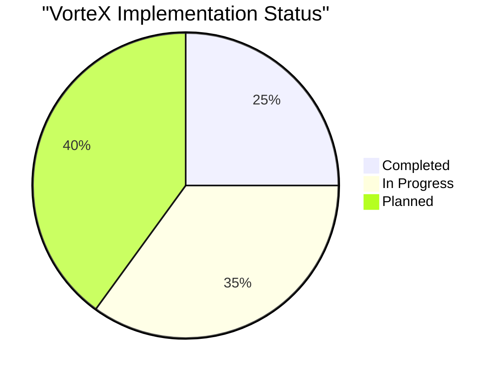

# VorteX Current Status

This document provides a candid assessment of the current state of the VorteX project, including completed work, work in progress, and known limitations.

## Project Status Overview

## Component Status Summary

| Component | Status | Completion % | Notes |
|-----------|--------|--------------|-------|
| Project Structure | Completed | 100% | Basic directory structure and file organization |
| Documentation | In Progress | 80% | Architecture, roadmap, and vision docs created |
| HTML/UI Foundation | In Progress | 40% | Basic structure with wallet UI implementation |
| HTMX Integration | In Progress | 10% | Structure for HTMX integration created |
| TEE DOGG Agent | Started | 15% | Basic structure with placeholder logic |
| Web Audio API | Planned | 0% | Architecture defined but not implemented |
| Sequence Wallet | In Progress | 50% | Mock implementation with state management |
| Startale Dice Roller | In Progress | 40% | Mock structure with integration points defined |
| State Management | Completed | 90% | Singleton pattern implemented |
| Docker Setup | Completed | 90% | Basic containerization ready |

## Current Implementation Details

### What's Working

1. **Project Architecture**
   - Directory structure established
   - Component boundaries defined
   - Integration points identified

2. **Comprehensive Documentation**
   - README with project overview
   - Comprehensive documentation in `/docs` directory
   - Development roadmap established

3. **Docker Configuration**
   - Basic Dockerfile for containerization
   - Simple deployment process defined

4. **State Management System**
   - Singleton pattern implemented
   - Support for subscribing to state changes
   - Local storage persistence

5. **Mock Wallet Integration**
   - Basic wallet connection UI
   - Mock connection/disconnection functionality
   - State persistence for wallet status

6. **Mock NFT Verification**
   - Structure for verifying NFT ownership
   - Mock implementation for testing
   - Integration with state management

7. **Startale Integration Structure**
   - Configuration file for RPC endpoints
   - Mock dice roller implementation
   - Toggle for switching between mock and real implementation

### What's In Progress

1. **Frontend Foundation**
   - Enhanced HTML structure
   - Improved styling
   - JavaScript implementation for UI interactions

2. **TEE DOGG Agent**
   - Basic agent structure
   - Placeholder dialogue system
   - Integration points with other components

3. **Interface Layer**
   - Communication structure between components
   - Event handling framework
   - Integration with wallet and dice roller

4. **HTMX Integration**
   - Structure for HTMX interactions
   - Basic attribute-based updates
   - Integration with state management

### What's Not Yet Implemented

1. **Real Blockchain Integration**
   - Actual Sequence SDK integration
   - Real NFT verification
   - Actual Startale RPC connection

2. **Web Audio API**
   - Voice playback
   - Ambient audio
   - UI sound effects
   - Audio layering

3. **Full User Experience**
   - Complete TEE DOGG dialogue
   - Immersive audio environment
   - Responsive UI

## Known Limitations

### Technical Limitations

1. **Mock Blockchain Integration**
   - Wallet connection uses mock implementation
   - NFT verification is simulated
   - Dice roller uses client-side randomness

2. **Limited Functionality**
   - Some files contain placeholder code
   - No working audio implementation
   - UI is functional but minimal

3. **Incomplete User Flow**
   - Basic user journey implemented
   - Some interaction points still missing
   - Limited error handling

### Documentation vs. Implementation

1. **README Accuracy**
   - README now accurately reflects implementation status
   - Tech stack includes both implemented and planned technologies
   - Clear distinction between what's working and what's planned

2. **Architecture vs. Reality**
   - Architecture documents describe both current and ideal state
   - Implementation is progressing toward the documented architecture
   - Integration points defined and partially connected

## Immediate Next Steps

The following items represent the highest priority next steps:

1. **Enhanced HTMX Implementation**
   - Expand HTMX integration
   - Implement more dynamic interactions
   - Create better content updates

2. **TEE DOGG Basic Dialogue**
   - Implement simple state machine for conversations
   - Create basic dialogue tree
   - Add minimal styling for dialogue display

3. **Real Sequence Integration**
   - Replace mock wallet implementation with real Sequence SDK
   - Implement actual NFT verification
   - Handle real blockchain interactions

4. **Real Startale Integration**
   - Connect to actual Startale RPC endpoints
   - Implement real dice rolling functionality
   - Handle blockchain transaction responses

## Development Progress

Recent progress includes:

1. **State Management Implementation**
   - Created a robust state management system
   - Implemented the singleton pattern
   - Added support for subscribing to state changes

2. **Mock Wallet Integration**
   - Implemented mock wallet connection UI
   - Created connection/disconnection functionality
   - Added state persistence for wallet status

3. **Startale Integration Structure**
   - Created configuration file for RPC endpoints
   - Implemented mock dice roller
   - Added toggle for switching between mock and real implementation

## Hackathon Submission Context

As a hackathon submission, it's important to note:

1. **Working Prototype Stage**
   - Current implementation demonstrates functional architecture
   - Shows technical vision and planning
   - Provides foundation for future development

2. **Vision vs. Implementation**
   - Strong conceptual foundation
   - Clear technical vision and roadmap
   - Implementation is progressing well

3. **Learning Outcomes**
   - Valuable insights gained about integration challenges
   - Better understanding of Web3 implementation requirements
   - Clearer picture of development timeline needs

## Conclusion

The VorteX project has made significant progress, with a strong architectural foundation, comprehensive documentation, and functional implementation of key components. The project demonstrates good technical planning and vision, with a clear roadmap for future development.

For the Soneium Hackathon submission, the project can be presented as a working prototype with emphasis on the architectural thinking, technical vision, and implemented functionality.

The next phase of development will focus on replacing mock implementations with real blockchain integrations, enhancing the user experience, and implementing additional features.
