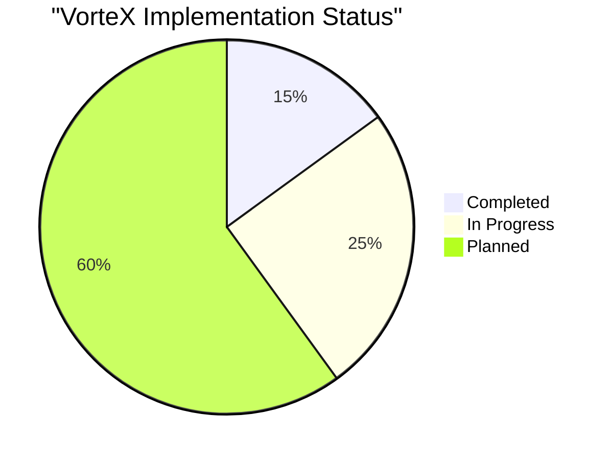

# VorteX Current Status

This document provides a candid assessment of the current state of the VorteX project, including completed work, work in progress, and known limitations.

## Project Status Overview

## Component Status Summary

| Component | Status | Completion % | Notes |
|-----------|--------|--------------|-------|
| Project Structure | Completed | 100% | Basic directory structure and file organization |
| Documentation | In Progress | 70% | Architecture, roadmap, and vision docs created |
| HTML/UI Foundation | Started | 20% | Basic structure with minimal implementation |
| HTMX Integration | Planned | 0% | Listed in tech stack but not implemented |
| TEE DOGG Agent | Started | 10% | Basic structure with placeholder logic |
| Web Audio API | Planned | 0% | Architecture defined but not implemented |
| Sequence Wallet | Planned | 0% | Integration points identified |
| Startale Dice Roller | Planned | 0% | Mock structure defined |
| Docker Setup | Completed | 90% | Basic containerization ready |

## Current Implementation Details

### What's Working

1. **Project Architecture**
   - Directory structure established
   - Component boundaries defined
   - Integration points identified

2. **Basic Documentation**
   - README with project overview
   - Comprehensive documentation in `/docs` directory
   - Development roadmap established

3. **Docker Configuration**
   - Basic Dockerfile for containerization
   - Simple deployment process defined

### What's In Progress

1. **Frontend Foundation**
   - Basic HTML structure
   - Minimal styling
   - Placeholder JavaScript files

2. **TEE DOGG Agent**
   - Basic agent structure
   - Placeholder dialogue system
   - Integration points with other components

3. **Interface Layer**
   - Communication structure between components
   - Event handling framework

### What's Not Yet Implemented

1. **HTMX Integration**
   - Dynamic UI updates
   - Form handling
   - WebSocket/SSE connections

2. **Web Audio API**
   - Voice playback
   - Ambient audio
   - UI sound effects
   - Audio layering

3. **Blockchain Integration**
   - Sequence wallet connection
   - NFT verification
   - Startale dice roller integration

4. **Full User Experience**
   - Complete TEE DOGG dialogue
   - Immersive audio environment
   - Responsive UI

## Known Limitations

### Technical Limitations

1. **No Actual Blockchain Integration**
   - Wallet connection is not implemented
   - NFT verification is conceptual only
   - Dice roller lacks Startale RPC connection

2. **Limited Functionality**
   - Most files contain placeholder code
   - No working audio implementation
   - UI is minimal and non-interactive

3. **Incomplete User Flow**
   - Cannot complete full user journey
   - Missing key interaction points
   - No error handling for edge cases

### Documentation Discrepancies

1. **README vs. Implementation**
   - README mentions features not yet implemented
   - Tech stack includes technologies not yet integrated
   - "RPC ready" is aspirational rather than current state

2. **Architecture vs. Reality**
   - Architecture documents describe ideal state
   - Current implementation is skeletal compared to documentation
   - Integration points defined but not connected

## Immediate Next Steps

The following items represent the highest priority next steps:

1. **Basic HTMX Implementation**
   - Add HTMX library to project
   - Implement 2-3 simple interactions
   - Create dynamic content updates

2. **TEE DOGG Basic Dialogue**
   - Implement simple state machine for conversations
   - Create basic dialogue tree
   - Add minimal styling for dialogue display

3. **Simple Audio Integration**
   - Add Web Audio API basic implementation
   - Include sample audio files
   - Create simple playback controls

4. **Mock Wallet Connection**
   - Create UI for wallet connection
   - Implement mock connection flow
   - Simulate NFT verification

## Development Blockers

Current challenges preventing further progress:

1. **Technical Complexity**
   - Integration of multiple technologies requires more development time
   - Web3 components have steep learning curve
   - Audio implementation requires specialized knowledge

2. **Resource Constraints**
   - Limited development time available
   - Competing priorities during hackathon
   - Specialized skills needed for certain components

3. **Integration Challenges**
   - Connecting disparate technologies requires careful planning
   - Ensuring consistent user experience across components
   - Maintaining performance with multiple systems

## Hackathon Submission Context

As a hackathon submission, it's important to note:

1. **Proof of Concept Stage**
   - Current implementation demonstrates architectural thinking
   - Shows technical vision and planning
   - Provides foundation for future development

2. **Vision vs. Implementation**
   - Strong conceptual foundation
   - Clear technical vision and roadmap
   - Implementation is at early stages

3. **Learning Outcomes**
   - Valuable insights gained about integration challenges
   - Better understanding of Web3 implementation requirements
   - Clearer picture of development timeline needs

## Conclusion

The VorteX project is currently in the early stages of development, with a strong architectural foundation and comprehensive documentation, but limited functional implementation. The project demonstrates good technical planning and vision, with a clear roadmap for future development.

For the Soneium Hackathon submission, the project should be presented as a work-in-progress with emphasis on the architectural thinking, technical vision, and future potential rather than current functionality.

The next phase of development will focus on implementing core functionality to create a minimal viable experience, starting with HTMX integration, basic TEE DOGG dialogue, and simple audio implementation.
