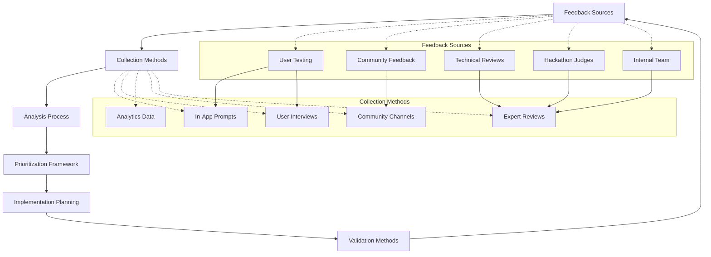
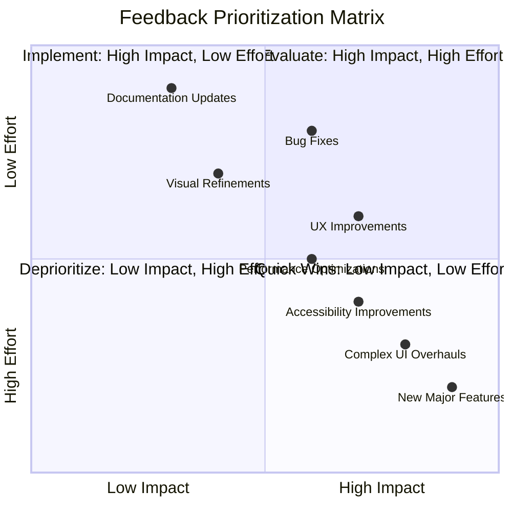
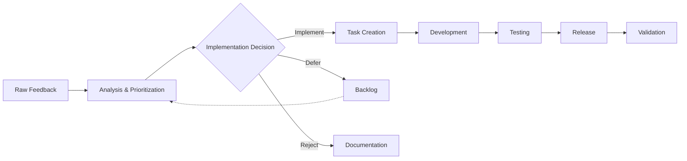
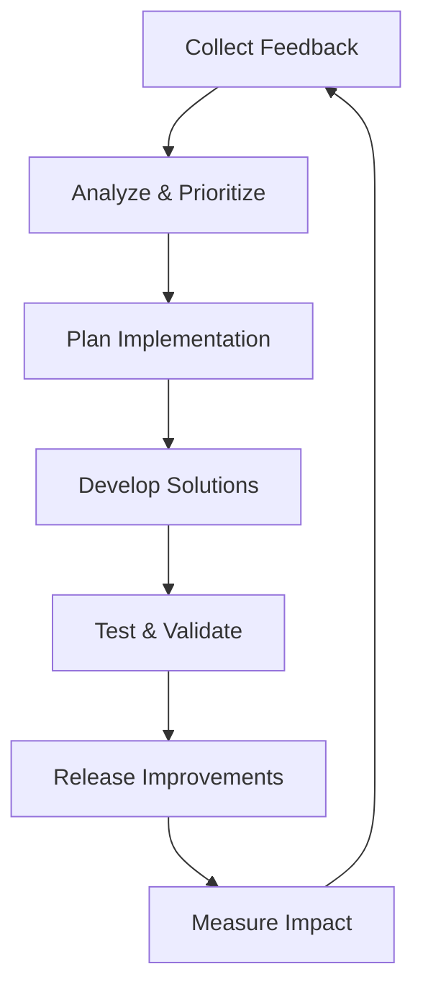

# VorteX Feedback Framework

This document outlines the structured approach to gathering, analyzing, and implementing feedback for the VorteX project, ensuring continuous improvement through iterative development.

## Feedback Collection Strategy

## Feedback Collection Methods

### 1. In-App Feedback

Structured feedback collection within the VorteX experience:

| Trigger Point | Feedback Type | Collection Method |
|---------------|--------------|-------------------|
| Post-Authentication | Wallet Connection Experience | Quick Rating (1-5) + Optional Comment |
| Post-Dice Roll | Interaction Satisfaction | Emoji Selection + Optional Comment |
| Feature Discovery | Discoverability | Yes/No Question + Follow-up |
| Exit Experience | Overall Satisfaction | Short Survey (3-5 questions) |
| Error Encounters | Technical Issues | Problem Report Form |

### 2. User Interviews

Structured conversations with users to gather deeper insights:

- **Frequency**: Monthly during development, quarterly after launch
- **Format**: 30-minute semi-structured interviews
- **Participant Selection**: Mix of power users and new users
- **Focus Areas**: User journey pain points, feature requests, overall experience

### 3. Analytics Data

Passive data collection to understand user behavior:

| Metric | Purpose | Collection Method |
|--------|---------|-------------------|
| Session Duration | Engagement Measurement | Automatic Tracking |
| Feature Usage | Feature Popularity | Event Tracking |
| Drop-off Points | UX Problem Identification | Funnel Analysis |
| Return Rate | Loyalty Measurement | User Identification |
| Error Frequency | Technical Issue Identification | Error Logging |

### 4. Community Channels

Monitoring and engaging with community feedback:

- **Discord Channel**: Dedicated feedback and suggestions channel
- **Twitter Monitoring**: Tracking mentions and discussions
- **GitHub Issues**: Public issue tracker for technical feedback
- **Community Calls**: Monthly open discussions with community

### 5. Expert Reviews

Soliciting feedback from technical and domain experts:

- **Technical Audits**: Code and architecture reviews
- **UX Expert Reviews**: Heuristic evaluations of user experience
- **Web3 Specialist Input**: Blockchain integration best practices
- **Accessibility Reviews**: Ensuring inclusive design

## Feedback Analysis Process

### 1. Collection & Aggregation

- **Weekly Aggregation**: All feedback consolidated weekly
- **Categorization**: Sorted by type, source, and affected component
- **Quantification**: Converting qualitative feedback to measurable data
- **Trend Identification**: Spotting patterns across feedback sources

### 2. Impact Assessment

Each feedback item is evaluated based on:

| Criterion | Description | Weight |
|-----------|-------------|--------|
| User Impact | How many users are affected | 30% |
| Severity | How significantly it affects experience | 25% |
| Strategic Alignment | How well it aligns with project goals | 20% |
| Implementation Effort | Resources required to address | 15% |
| Urgency | Time sensitivity of the issue | 10% |

### 3. Prioritization Matrix

## Implementation Planning

### 1. Development Cycle Integration

Feedback is incorporated into the development process through:

- **Bi-weekly Planning**: Prioritized feedback reviewed every two weeks
- **Issue Creation**: Feedback translated into actionable development tasks
- **Sprint Allocation**: High-priority items assigned to upcoming sprints
- **Backlog Management**: Lower priority items maintained in prioritized backlog

### 2. Feedback-to-Feature Pipeline

### 3. Communication Loop

Maintaining transparency with feedback providers:

- **Acknowledgment**: All feedback receives acknowledgment
- **Status Updates**: Regular updates on implementation status
- **Release Notes**: Clear communication of implemented feedback
- **Follow-up**: Checking back with original feedback providers

## Validation Methods

### 1. Success Metrics

Measuring the impact of implemented feedback:

| Metric | Description | Target |
|--------|-------------|--------|
| Resolution Rate | Percentage of feedback items addressed | >70% quarterly |
| User Satisfaction | Change in satisfaction scores | +10% after implementation |
| Feature Adoption | Usage of new/modified features | >30% of user base |
| Issue Recurrence | Frequency of similar feedback after fix | <10% recurrence |

### 2. A/B Testing

For significant changes based on feedback:

- **Test Group Selection**: Random sampling of user base
- **Implementation Variants**: Multiple solutions tested when appropriate
- **Success Criteria**: Clear metrics for determining optimal solution
- **Rollout Strategy**: Phased implementation based on test results

### 3. Follow-up Validation

Direct validation with original feedback providers:

- **Targeted Surveys**: Specific questions about implemented changes
- **User Interviews**: In-depth discussions about experience improvements
- **Usage Tracking**: Monitoring behavior changes post-implementation

## Feedback Prioritization Framework

### Priority Levels

| Level | Description | Response Time | Implementation Timeline |
|-------|-------------|---------------|-------------------------|
| P0 | Critical issues affecting core functionality | 24 hours | Immediate fix |
| P1 | High-impact issues affecting many users | 3 days | Next sprint |
| P2 | Medium-impact improvements | 1 week | Within quarter |
| P3 | Low-impact enhancements | 2 weeks | Roadmap consideration |
| P4 | Nice-to-have suggestions | 1 month | Future consideration |

### Categorization Framework

Feedback is categorized across multiple dimensions:

1. **Component Area**:
   - User Interface
   - Audio Experience
   - TEE DOGG Interaction
   - Wallet Integration
   - Dice Rolling Mechanism
   - Performance & Technical

2. **Feedback Type**:
   - Bug Report
   - Feature Request
   - UX Improvement
   - Performance Issue
   - Conceptual Suggestion

3. **User Segment**:
   - New Users
   - Returning Users
   - Power Users
   - Web3 Natives
   - Web3 Newcomers

## Continuous Improvement Cycle

## Hackathon-Specific Feedback Integration

For the Soneium Hackathon submission:

### Judge Feedback Collection

- **Submission Form**: Specific questions requesting technical and conceptual feedback
- **Demo Session**: Structured feedback collection during presentations
- **Follow-up Questions**: Prepared questions to elicit specific feedback

### Rapid Integration Plan

1. **Immediate Triage**: Sort hackathon feedback by implementation difficulty
2. **Quick Fixes**: Implement simple improvements within 48 hours
3. **Documentation Updates**: Clarify misunderstood aspects within 24 hours
4. **Roadmap Adjustments**: Incorporate strategic feedback into development plan

## Conclusion

This feedback framework establishes a structured approach to collecting, analyzing, and implementing user and technical feedback. By maintaining this systematic process, the VorteX project can continuously improve based on real user needs and technical best practices, ensuring the experience evolves in alignment with both user expectations and project goals.

The framework is designed to be adaptable, allowing for adjustments to the process itself based on meta-feedback about how effectively feedback is being handled and implemented.
