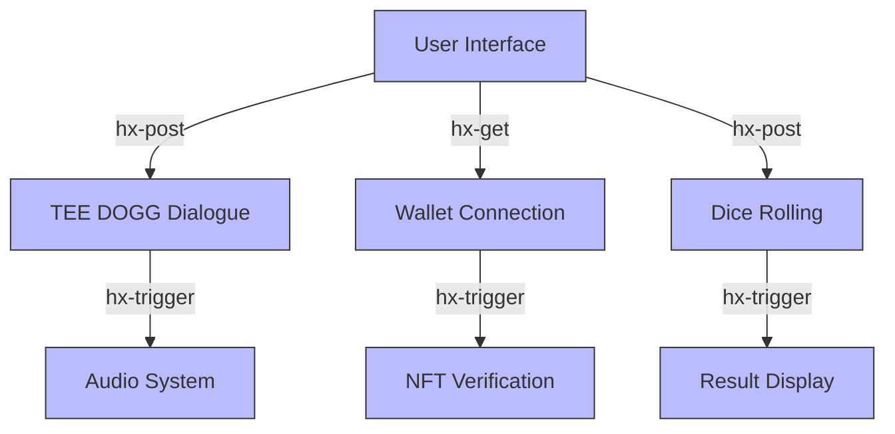

# HTMX in VorteX

This document provides a detailed explanation of why HTMX was selected for the VorteX project, how it will be implemented, and the benefits it brings to the application architecture.

## What is HTMX?

HTMX is a lightweight JavaScript library that allows you to access modern browser features directly from HTML, rather than using JavaScript. It enables HTML elements to make AJAX requests, trigger WebSocket connections, use Server-Sent Events, and perform other dynamic behaviors through HTML attributes.

```html
<!-- Example: Simple HTMX interaction -->
<button hx-post="/trigger-dice-roll" 
        hx-target="#result-area" 
        hx-swap="outerHTML">
  Roll the Dice
</button>
```

## Why HTMX for VorteX?

### 1. Reduced JavaScript Complexity

HTMX allows us to create dynamic, interactive interfaces with minimal JavaScript code. For a hackathon project with time constraints, this provides several advantages:

- **Faster Development**: Less custom JavaScript means faster implementation
- **Fewer Bugs**: Reduced code complexity leads to fewer potential issues
- **Easier Maintenance**: Simpler codebase is easier to understand and modify

### 2. HTML-Centric Development

HTMX keeps the focus on HTML structure, which aligns with our goal of creating a clean, accessible interface:

- **Semantic Structure**: Encourages proper HTML semantics
- **Progressive Enhancement**: Builds on HTML's inherent capabilities
- **Accessibility**: Easier to maintain accessibility with proper HTML structure

### 3. Lightweight Performance

For an immersive experience like VorteX, performance is critical:

- **Small Footprint**: ~14KB minified and gzipped
- **No Large Framework**: Avoids the overhead of larger frameworks
- **Efficient Updates**: Only updates the parts of the page that change

### 4. Perfect for Audio-Focused Applications

VorteX is heavily audio-focused, and HTMX works well with this approach:

- **Minimal Visual Refreshes**: Updates content without page reloads that would interrupt audio
- **Event-Driven Model**: Complements our audio event system
- **Background Processing**: Handles interactions while audio continues uninterrupted

### 5. Compatibility with Web Components

Our architecture uses modular components, which HTMX supports well:

- **Clean Integration**: Works seamlessly with Web Components
- **Attribute-Based API**: Declarative approach matches component thinking
- **Event System**: Built-in event system aligns with component communication

## Current Implementation Status

As of the current development stage:

- **HTMX Integration**: Planned but not yet implemented
- **Required Files**: Identified but not added to the project
- **Interaction Points**: Defined in architecture but not coded

## Planned HTMX Implementation

### Core Integration Points



### Key HTMX Features to Utilize

1. **AJAX Requests (`hx-get`, `hx-post`)**
   - Dialogue interactions with TEE DOGG
   - Wallet connection requests
   - Dice rolling triggers

2. **Content Swapping (`hx-swap`)**
   - Updating dialogue areas
   - Displaying dice results
   - Showing wallet status

3. **CSS Transitions (`hx-transition`)**
   - Smooth animations between states
   - Visual feedback for interactions
   - Enhancing immersion without heavy JS

4. **WebSockets (`hx-ws`)**
   - Real-time updates for multi-user scenarios
   - Live dice roll results
   - Dynamic TEE DOGG responses

5. **Triggers (`hx-trigger`)**
   - Custom events for audio playback
   - Timing-based interactions
   - Conditional behaviors

## Implementation Examples

### TEE DOGG Dialogue System

```html
<div id="tee-dogg-dialogue">
  <div class="dialogue-history">
    <!-- Previous dialogue appears here -->
  </div>
  
  <div class="user-input">
    <input type="text" name="user-message" 
           hx-post="/api/dialogue" 
           hx-trigger="keyup[keyCode==13]"
           hx-target=".dialogue-history" 
           hx-swap="beforeend">
    
    <button hx-post="/api/dialogue" 
            hx-include="[name='user-message']" 
            hx-target=".dialogue-history" 
            hx-swap="beforeend">
      Send
    </button>
  </div>
</div>
```

### Wallet Connection

```html
<div id="wallet-section">
  <button hx-get="/api/connect-wallet" 
          hx-target="#wallet-status" 
          hx-swap="outerHTML"
          hx-trigger="click"
          hx-indicator="#connection-indicator">
    Connect Wallet
  </button>
  
  <div id="connection-indicator" class="htmx-indicator">
    Connecting...
  </div>
  
  <div id="wallet-status">
    Not connected
  </div>
</div>
```

### Dice Rolling Mechanism

```html
<div id="dice-section">
  <button hx-post="/api/roll-dice" 
          hx-target="#dice-result" 
          hx-swap="innerHTML"
          hx-trigger="click"
          hx-indicator="#rolling-indicator">
    Roll the Dice
  </button>
  
  <div id="rolling-indicator" class="htmx-indicator">
    
  </div>
  
  <div id="dice-result">
    <!-- Dice result will appear here -->
  </div>
</div>
```

## Integration with Audio System

One of the key advantages of HTMX for VorteX is how it enables seamless integration with our Web Audio API implementation:

```html
<button hx-post="/api/tee-dogg/greet" 
        hx-target="#dialogue-area" 
        hx-swap="innerHTML"
        hx-on::after-request="playAudio('tee-dogg-greeting')">
  Approach TEE DOGG
</button>

<script>
  // Minimal JavaScript needed just for audio playback
  function playAudio(soundId) {
    // Web Audio API implementation
    const audioContext = new (window.AudioContext || window.webkitAudioContext)();
    // Load and play the appropriate audio
  }
</script>
```

## HTMX Extension Opportunities

For VorteX-specific needs, we can leverage HTMX's extension system:

### Potential Custom Extensions

1. **`hx-audio`**: Custom extension for advanced audio control
   ```html
   <button hx-post="/api/action" 
           hx-audio="src:/audio/effect.mp3;volume:0.8;loop:false">
     Trigger Action with Sound
   </button>
   ```

2. **`hx-3d`**: Extension for WebGL/3D scene interactions
   ```html
   <button hx-post="/api/scene-change" 
           hx-3d="target:#scene;transition:fade;duration:2s">
     Change Scene
   </button>
   ```

## Performance Considerations

HTMX is well-suited for VorteX's performance needs:

1. **Minimal DOM Updates**: Only changes what's needed
2. **Reduced Client-Side Processing**: Less JavaScript execution
3. **Progressive Loading**: Can load content as needed
4. **Caching Opportunities**: Browser can cache responses
5. **Reduced Memory Footprint**: Lighter than full frameworks

## Implementation Roadmap

### Phase 1: Basic HTMX Integration
- Add HTMX library to project
- Implement basic dialogue interaction
- Create simple UI updates

### Phase 2: Advanced Features
- Add WebSocket for real-time updates
- Implement custom transitions
- Create audio trigger extensions

### Phase 3: Optimization
- Performance tuning
- Accessibility enhancements
- Advanced interaction patterns

## Conclusion

HTMX represents an ideal choice for the VorteX project due to its lightweight nature, HTML-centric approach, and perfect fit for audio-focused applications. While not yet implemented in the current codebase, the planned integration will enable rich, interactive experiences with minimal JavaScript complexity.

The library's approach aligns perfectly with our architectural goals of modularity, performance, and progressive enhancement, making it a strategic technology choice for this project.
