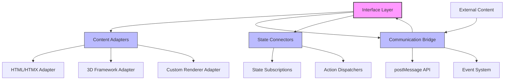

# Interface Layer Architecture

This document outlines the architecture of the VorteX interface layer, focusing on its modularity, scalability, and ability to support diverse content and experiences.

## Core Design Principles

The interface layer in VorteX is designed with the following core principles:

1. **Content Agnosticism**: The interface layer should be able to host any type of content or experience, from simple HTML to complex 3D environments.

2. **Framework Independence**: No hard dependencies on specific frameworks or libraries, allowing content creators to use their preferred technologies.

3. **Clean Communication**: Standardized communication protocols between the core system and embedded content.

4. **Progressive Enhancement**: Basic functionality works with simple technologies, with enhanced experiences available through more sophisticated frameworks.

## Architecture Overview



## Key Components

### Content Adapters

Content adapters provide a consistent interface for loading and interacting with different types of content:

```javascript
// Example adapter interface
class ContentAdapter {
  constructor(options) {
    this.options = options;
  }
  
  load(container) {
    // Load content into container
  }
  
  unload() {
    // Unload content and clean up resources
  }
  
  sendMessage(message) {
    // Send message to content
  }
  
  onMessage(callback) {
    // Register callback for messages from content
  }
}
```

Specific adapters implement this interface for different content types:

1. **HTML/HTMX Adapter**: Loads HTML content with HTMX attributes for dynamic updates
2. **3D Framework Adapter**: Loads Unity, Three.js, or other 3D framework content
3. **Custom Renderer Adapter**: Supports custom rendering technologies

### Communication Bridge

The communication bridge provides a standardized way for the core system to communicate with embedded content:

```javascript
// Example communication bridge
class CommunicationBridge {
  constructor() {
    this.messageHandlers = new Map();
    this.setupMessageListeners();
  }
  
  setupMessageListeners() {
    window.addEventListener('message', this.handleMessage.bind(this));
  }
  
  handleMessage(event) {
    const { type, data } = event.data;
    if (this.messageHandlers.has(type)) {
      this.messageHandlers.get(type)(data);
    }
  }
  
  registerHandler(type, handler) {
    this.messageHandlers.set(type, handler);
  }
  
  sendMessage(target, type, data) {
    target.postMessage({ type, data }, '*');
  }
}
```

This bridge supports:

1. **postMessage API**: For communication with iframes and web workers
2. **Event System**: For communication within the same context
3. **Future Extensions**: WebRTC, WebSockets, or other protocols

### State Connectors

State connectors link the interface layer to the application's state management system:

```javascript
// Example state connector
class StateConnector {
  constructor(stateManager) {
    this.stateManager = stateManager;
    this.subscriptions = new Map();
  }
  
  subscribe(component, stateSelector, callback) {
    const subscription = this.stateManager.subscribe(state => {
      const selectedState = stateSelector(state);
      callback(selectedState);
    });
    
    this.subscriptions.set(component, subscription);
    return subscription;
  }
  
  unsubscribe(component) {
    if (this.subscriptions.has(component)) {
      this.subscriptions.get(component)();
      this.subscriptions.delete(component);
    }
  }
  
  dispatchAction(action) {
    this.stateManager.updateState(action);
  }
}
```

This connector:

1. **Subscribes to State**: Components can subscribe to relevant parts of the application state
2. **Dispatches Actions**: Components can update the application state through actions
3. **Manages Subscriptions**: Handles subscription lifecycle to prevent memory leaks

## Content Loading Process

The interface layer loads content through a standardized process:

```javascript
// Example content loading process
async function loadContent(type, options, container) {
  // 1. Select appropriate adapter
  const adapter = getAdapterForType(type);
  
  // 2. Initialize adapter with options
  const contentAdapter = new adapter(options);
  
  // 3. Prepare container
  prepareContainer(container);
  
  // 4. Load content
  await contentAdapter.load(container);
  
  // 5. Set up communication
  setupCommunication(contentAdapter);
  
  // 6. Connect to state
  connectToState(contentAdapter);
  
  // 7. Return adapter for future reference
  return contentAdapter;
}
```

This process ensures:

1. **Consistent Loading**: All content types follow the same loading process
2. **Resource Management**: Proper initialization and cleanup of resources
3. **Communication Setup**: Standardized communication channels
4. **State Integration**: Connection to the application state

## Multi-User and Peer-to-Peer Considerations

The interface layer is designed to support future multi-user and peer-to-peer functionality:

### Multi-User Support

```javascript
// Example multi-user extension
class MultiUserAdapter extends ContentAdapter {
  constructor(options) {
    super(options);
    this.users = new Map();
    this.setupUserSync();
  }
  
  setupUserSync() {
    // Set up synchronization with backend
    this.syncInterval = setInterval(() => {
      this.syncUserStates();
    }, 100);
  }
  
  syncUserStates() {
    // Synchronize user states with backend
    // This would use WebSockets or similar for real-time updates
  }
  
  addUser(userId, initialState) {
    this.users.set(userId, initialState);
    this.sendMessage({
      type: 'USER_JOINED',
      userId,
      state: initialState
    });
  }
  
  updateUserState(userId, state) {
    if (this.users.has(userId)) {
      this.users.set(userId, state);
      this.sendMessage({
        type: 'USER_UPDATED',
        userId,
        state
      });
    }
  }
  
  removeUser(userId) {
    if (this.users.has(userId)) {
      this.users.delete(userId);
      this.sendMessage({
        type: 'USER_LEFT',
        userId
      });
    }
  }
}
```

### Peer-to-Peer Capabilities

```javascript
// Example P2P extension
class P2PAdapter extends ContentAdapter {
  constructor(options) {
    super(options);
    this.peers = new Map();
    this.setupP2P();
  }
  
  setupP2P() {
    // Set up WebRTC connections
    // This would use a signaling server initially
    // Then establish direct P2P connections
  }
  
  connectToPeer(peerId) {
    // Establish connection to peer
    // This would use WebRTC for direct communication
  }
  
  sendToPeer(peerId, message) {
    // Send message directly to peer
    // This bypasses the server for efficiency
  }
  
  broadcastToPeers(message) {
    // Send message to all connected peers
    // This is more efficient than going through the server
  }
}
```

## Scalability Considerations

The interface layer is designed to scale in several dimensions:

### Content Complexity

The interface layer can support content of increasing complexity:

1. **Simple HTML/CSS/JS**: Basic interfaces with minimal interactivity
2. **HTMX-Enhanced Interfaces**: More dynamic interfaces with declarative updates
3. **2D Canvas Applications**: Interactive 2D applications and visualizations
4. **3D WebGL Experiences**: Immersive 3D environments and games
5. **VR/AR Experiences**: Fully immersive virtual or augmented reality

### User Scale

The interface layer can scale to support different numbers of users:

1. **Single User**: Basic experience for individual users
2. **Small Groups**: Support for small group interactions
3. **Large Audiences**: Broadcast-style experiences for large audiences
4. **Massive Concurrent Users**: Sharded experiences for massive scale

### Geographic Distribution

The interface layer can support different geographic distributions:

1. **Local**: Single-location experiences
2. **Regional**: Experiences optimized for specific regions
3. **Global**: Globally distributed experiences with latency considerations
4. **Edge-Computed**: Experiences that leverage edge computing for minimal latency

## Implementation Roadmap

The interface layer will be implemented in phases:

### Phase 1: Basic Structure (Current)

- Core interface layer architecture
- HTML/HTMX adapter
- Basic communication bridge
- State connector for singleton state

### Phase 2: Enhanced Adapters

- 3D framework adapters (Unity, Three.js)
- Enhanced communication protocols
- Content preloading and caching
- Performance optimizations

### Phase 3: Multi-User Support

- Backend synchronization
- User presence and state sharing
- Conflict resolution strategies
- Real-time updates

### Phase 4: P2P Capabilities

- WebRTC integration
- Direct peer communication
- Hybrid server/P2P models
- Network resilience strategies

## Conclusion

The interface layer's modular, scalable architecture provides a solid foundation for VorteX's current and future needs. By maintaining clear boundaries between components and standardized communication protocols, it enables a wide range of content types and experience models while ensuring maintainability and extensibility.

This architecture supports the project's vision of creating diverse, engaging cultural experiences on Soneium, with a clear path from simple implementations to sophisticated multi-user environments.
