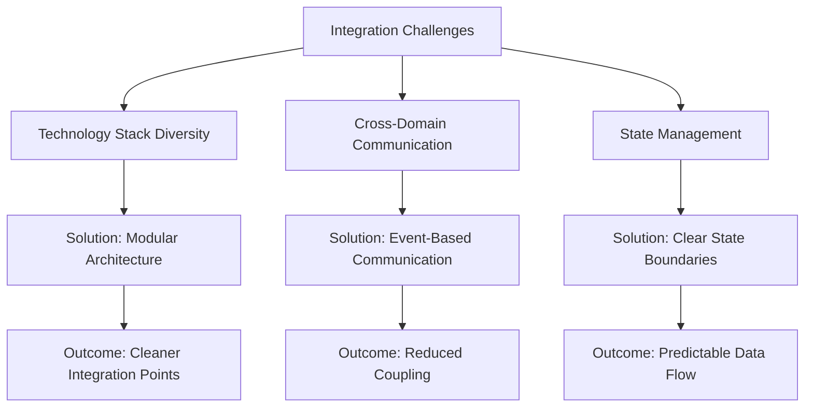

# VorteX: Lessons Learned

This document captures key insights, challenges, and lessons learned during the development of the VorteX project. These reflections serve both as a record of the development journey and as guidance for future iterations.

## Technical Insights

### 1. Integration Complexity

**Key Insight**: Integrating Web3 technologies, audio systems, and interactive UI requires careful planning of communication patterns.

**Challenge**: Different domains (blockchain, audio, UI) have different state management needs and update frequencies.

**Solution**: Implementing a clear event-based communication system with well-defined interfaces between components.

**Lesson**: Start with interface definitions and communication protocols before implementing individual components.

### 2. Technology Selection Trade-offs

**Key Insight**: Choosing the right technology involves balancing multiple factors beyond technical capabilities.

**Challenge**: Evaluating HTMX vs. React vs. vanilla JS for the frontend implementation.

**Considerations**:
- Development speed vs. long-term maintainability
- Bundle size vs. feature richness
- Learning curve vs. community support
- Performance vs. developer experience

**Decision Process**:
1. Identified core requirements (dynamic UI, audio continuity, minimal JS)
2. Evaluated options against these requirements
3. Prototyped critical interactions in different technologies
4. Selected HTMX for its HTML-centric approach and minimal footprint

**Lesson**: Technology selection should be driven by specific project needs rather than popularity or familiarity.

### 3. Architecture First Approach

**Key Insight**: Investing time in architecture before implementation creates a stronger foundation.

**Challenge**: Balancing the desire for quick implementation with the need for solid architecture.

**Approach**:
1. Defined clear component boundaries
2. Established communication patterns
3. Documented integration points
4. Created placeholder implementations

**Results**:
- Clearer development path
- Better understanding of dependencies
- More accurate time estimates
- Easier onboarding for new developers

**Lesson**: The time invested in architectural planning pays dividends throughout the development process.

## Process Insights

### 1. Documentation as a Design Tool

**Key Insight**: Documentation serves not just as a record but as an active design tool.

**Challenge**: Capturing design decisions and architectural thinking in a useful format.

**Approach**:
1. Created documentation alongside architecture development
2. Used diagrams to visualize relationships
3. Documented rationales, not just decisions
4. Maintained living documents that evolved with the project

**Benefits**:
- Forced clarification of fuzzy concepts
- Revealed inconsistencies in thinking
- Provided reference for implementation decisions
- Created shared understanding among team members

**Lesson**: Documentation should be treated as a design artifact, not an afterthought.

### 2. Iterative Scope Definition

**Key Insight**: Project scope benefits from iterative refinement rather than upfront definition.

**Challenge**: Defining appropriate scope for a hackathon project with multiple technologies.

**Approach**:
1. Started with broad vision
2. Identified core experience elements
3. Prioritized based on technical dependencies
4. Refined scope as architecture developed

**Evolution**:
- Initial scope: Full implementation of all features
- Refined scope: Architectural foundation with key interaction prototypes
- Final scope: Comprehensive documentation with placeholder implementations

**Lesson**: Allow scope to evolve based on architectural insights and time constraints.

### 3. Honest Progress Assessment

**Key Insight**: Transparent evaluation of progress leads to better decisions.

**Challenge**: Balancing optimism about capabilities with realistic assessment of progress.

**Approach**:
1. Established clear completion criteria for components
2. Regularly evaluated progress against these criteria
3. Documented both achievements and shortfalls
4. Adjusted plans based on actual progress

**Benefits**:
- More accurate timeline projections
- Better prioritization decisions
- Clearer communication about project status
- Reduced last-minute compromises

**Lesson**: Regular, honest assessment of progress enables better adaptation to constraints.

## Technical Challenges

### 1. Audio Continuity with Dynamic UI

**Challenge**: Maintaining continuous audio playback while updating UI elements.

**Approaches Considered**:
1. Single Page Application with state management
2. HTMX with partial page updates
3. Web Components with isolated state

**Selected Solution**: HTMX with audio state managed separately from UI state.

**Implementation Plan**:
- Audio context maintained in dedicated JavaScript module
- UI updates through HTMX without affecting audio playback
- Events for coordinating audio changes with UI changes

**Lesson**: Separate concerns between continuous processes (audio) and discrete updates (UI).

### 2. Blockchain Integration Complexity

**Challenge**: Integrating blockchain functionality without compromising user experience.

**Approaches Considered**:
1. Deep integration with direct blockchain calls
2. Abstracted integration through service layer
3. Mock implementation with future integration points

**Selected Solution**: Abstracted integration with clear boundaries between blockchain and application logic.

**Implementation Plan**:
- Well-defined interfaces for wallet connection and verification
- Asynchronous processing for blockchain operations
- Fallback mechanisms for handling network issues
- Clear user feedback during blockchain operations

**Lesson**: Abstract blockchain complexity behind well-defined interfaces to maintain UX quality.

### 3. Character-Driven Interaction Design

**Challenge**: Creating a compelling character-driven experience with technical constraints.

**Approaches Considered**:
1. Rule-based dialogue system
2. Integration with external LLM
3. Hybrid approach with scripted and dynamic elements

**Selected Solution**: Rule-based dialogue system with architecture supporting future LLM integration.

**Implementation Plan**:
- State machine for dialogue progression
- Context-aware responses based on user actions
- Audio integration for character voice
- Extension points for future AI enhancement

**Lesson**: Start with deterministic character behavior while designing for future AI integration.

## Project Management Insights

### 1. Hackathon Time Management

**Key Insight**: Hackathons require different time allocation than traditional projects.

**Challenge**: Balancing exploration, implementation, and presentation preparation.

**Approach**:
1. Front-loaded architecture and planning (40% of time)
2. Mid-project assessment and scope adjustment (10% of time)
3. Focused implementation of core elements (30% of time)
4. Documentation and presentation preparation (20% of time)

**Results**:
- Stronger architectural foundation
- Clearer communication of concept
- More realistic implementation goals
- Better presentation of work-in-progress

**Lesson**: Allocate substantial time for planning and presentation in hackathon contexts.

### 2. Technical Debt Management

**Key Insight**: Even in rapid development, technical debt must be managed.

**Challenge**: Balancing quick implementation with maintainable code.

**Approach**:
1. Identified acceptable vs. problematic technical debt
2. Documented known shortcuts and compromises
3. Created clear interfaces even with placeholder implementations
4. Prioritized architectural integrity over feature completeness

**Categories of Technical Debt**:
- **Acceptable**: Placeholder implementations with clear interfaces
- **Manageable**: Simplified implementations with documented limitations
- **Problematic**: Unclear interfaces or dependencies
- **Avoided**: Architectural compromises that would require rewrites

**Lesson**: Not all technical debt is equal; prioritize interface integrity over implementation completeness.

### 3. Documentation-Driven Development

**Key Insight**: Documentation can drive development rather than follow it.

**Challenge**: Creating meaningful documentation for partially implemented features.

**Approach**:
1. Documented intended behavior and architecture
2. Implemented to match documentation rather than documenting implementation
3. Used documentation as specification for development
4. Updated documentation with implementation insights

**Benefits**:
- Clearer development targets
- More consistent implementation
- Better communication of intent
- Documentation useful even with partial implementation

**Lesson**: Documentation can serve as both specification and communication tool throughout development.

## Future Directions

Based on these lessons, future development of VorteX should consider:

1. **Incremental Implementation**: Focus on implementing one complete vertical slice of functionality before expanding breadth.

2. **Interface Stability**: Maintain stable interfaces between components even as implementations evolve.

3. **User Testing Early**: Test core interaction patterns with users even before full implementation.

4. **Technical Spikes**: Conduct focused technical experiments for high-risk integration points.

5. **Documentation Evolution**: Continue to evolve documentation alongside code, treating it as a first-class artifact.

6. **Feedback Integration**: Establish clear processes for incorporating hackathon feedback into future development.

7. **Community Engagement**: Consider open-sourcing components that might benefit from community contribution.

## Conclusion

The development of VorteX, even in its early stages, has yielded valuable insights about integrating diverse technologies, managing development processes, and communicating technical vision. These lessons will inform not only the continued development of VorteX but also future projects involving similar technical domains.

By documenting these lessons, we create a foundation for continuous improvement and knowledge sharing that extends beyond the code itself.
