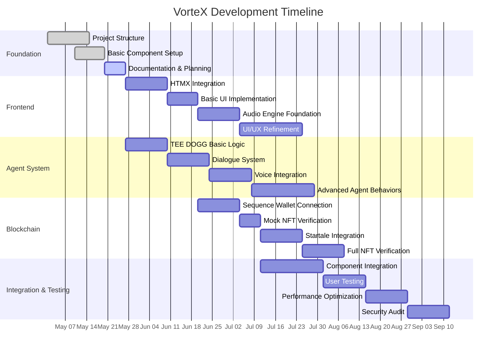
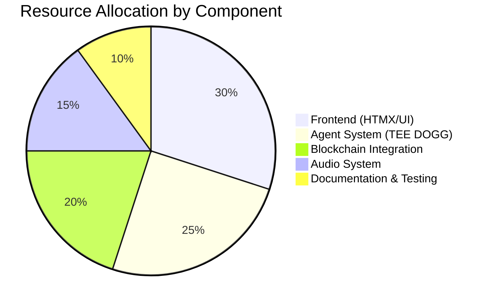

# VorteX Development Roadmap

This document outlines the development plan for the VorteX token-gated Web3 dApp, including timelines, milestones, and priorities.

## Development Timeline Visualization

## Development Phases

### Phase 1: Foundation (Current)

**Status: In Progress**

| Task | Description | Status | Priority |
|------|-------------|--------|----------|
| Project Structure | Establish basic directory structure and component organization | Completed | High |
| Basic Component Setup | Create placeholder files and minimal implementations | Completed | High |
| Documentation & Planning | Create comprehensive documentation and development plan | In Progress | High |

**Goals:**
- Establish clear architectural vision
- Create foundation for modular development
- Document technical decisions and rationales

**Deliverables:**
- Project structure with placeholder files
- Initial documentation
- Development roadmap

### Phase 2: Core Implementation

**Status: Planned**

| Task | Description | Dependencies | Priority |
|------|-------------|--------------|----------|
| HTMX Integration | Implement HTMX for dynamic UI interactions | Documentation | High |
| Basic UI Implementation | Create core UI components and layouts | HTMX Integration | High |
| TEE DOGG Basic Logic | Implement basic agent behavior and state machine | Documentation | High |
| Dialogue System | Create dialogue tree and interaction patterns | TEE DOGG Basic Logic | Medium |
| Sequence Wallet Connection | Implement basic wallet connection | Basic UI Implementation | Medium |

**Goals:**
- Create functional user interface with HTMX
- Implement basic TEE DOGG agent behavior
- Establish wallet connection flow

**Deliverables:**
- Functional UI with HTMX interactions
- Basic TEE DOGG dialogue system
- Wallet connection interface

### Phase 3: Feature Development

**Status: Planned**

| Task | Description | Dependencies | Priority |
|------|-------------|--------------|----------|
| Audio Engine Foundation | Implement Web Audio API integration | Basic UI Implementation | Medium |
| Voice Integration | Add voice capabilities to TEE DOGG | Audio Engine, Dialogue System | Medium |
| Mock NFT Verification | Create simulated NFT verification | Wallet Connection | Medium |
| Startale Integration | Implement dice roller with Startale | Mock NFT Verification | Medium |

**Goals:**
- Add audio and voice capabilities
- Implement mock blockchain interactions
- Create engaging user experience

**Deliverables:**
- Working audio system with multiple layers
- TEE DOGG voice integration
- Functional dice roller with mock data
- Simulated NFT verification

### Phase 4: Integration & Refinement

**Status: Planned**

| Task | Description | Dependencies | Priority |
|------|-------------|--------------|----------|
| Component Integration | Connect all components into cohesive system | All Phase 3 tasks | High |
| UI/UX Refinement | Polish user interface and experience | Component Integration | Medium |
| Advanced Agent Behaviors | Enhance TEE DOGG with more complex behaviors | Component Integration | Medium |
| Full NFT Verification | Implement actual blockchain verification | Startale Integration | Medium |

**Goals:**
- Create cohesive user experience
- Refine UI/UX for optimal engagement
- Implement actual blockchain integrations

**Deliverables:**
- Fully integrated system
- Polished user interface
- Complete TEE DOGG agent experience
- Working blockchain integrations

### Phase 5: Testing & Optimization

**Status: Planned**

| Task | Description | Dependencies | Priority |
|------|-------------|--------------|----------|
| User Testing | Conduct comprehensive user testing | Phase 4 completion | High |
| Performance Optimization | Optimize for performance and responsiveness | User Testing | Medium |
| Security Audit | Conduct security review of blockchain integrations | Performance Optimization | High |

**Goals:**
- Ensure optimal user experience
- Optimize performance
- Verify security of blockchain interactions

**Deliverables:**
- User testing report
- Optimized application
- Security audit documentation

## Critical Path Items

The following items represent the critical path for development:

1. **Documentation & Planning** → **HTMX Integration** → **Basic UI Implementation**
2. **Basic UI Implementation** → **Wallet Connection** → **Mock NFT Verification**
3. **Mock NFT Verification** → **Component Integration** → **User Testing**

Delays in these items will impact the overall timeline.

## Priority Framework

Tasks are prioritized based on the following criteria:

### High Priority
- Foundation for other components
- Core user experience elements
- Security-critical features

### Medium Priority
- Enhanced user experience
- Secondary features
- Integration components

### Low Priority
- Nice-to-have features
- Visual refinements
- Future expansion capabilities

## Resource Allocation

Recommended resource allocation based on component importance:

## Milestone Definitions

### Alpha Release
- Basic UI with HTMX integration
- TEE DOGG with simple dialogue
- Mock wallet connection
- Basic audio implementation

### Beta Release
- Complete TEE DOGG dialogue system
- Working wallet connection
- Mock NFT verification
- Dice roller implementation
- Full audio integration

### MVP Release
- Full blockchain integration
- Complete user experience
- Optimized performance
- Security audited

## Feedback Integration Points

The roadmap includes specific points for gathering and integrating feedback:

1. After Basic UI Implementation
2. After TEE DOGG Basic Logic implementation
3. After Mock NFT Verification
4. After Component Integration
5. Throughout User Testing

## Adaptation Strategy

This roadmap is designed to be flexible and adaptable. The following events may trigger roadmap adjustments:

1. **User Feedback**: Significant user feedback may reprioritize features
2. **Technical Challenges**: Unforeseen technical issues may require timeline adjustments
3. **Resource Changes**: Changes in available resources may affect parallel development capabilities
4. **Market Changes**: Shifts in Web3 landscape may necessitate feature adjustments

## Next Immediate Steps

1. Complete documentation and planning phase
2. Begin HTMX integration
3. Implement TEE DOGG basic logic
4. Create development environment for team collaboration
