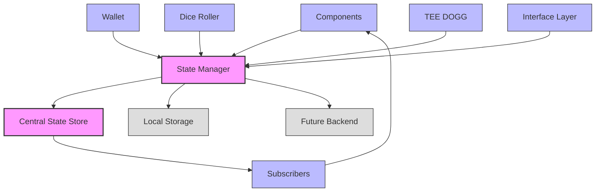

# Singleton State Pattern in VorteX

This document explains the singleton state pattern implemented in VorteX, its benefits, and how it supports the project's architecture.

## Overview

The singleton state pattern in VorteX provides a centralized state management system that serves as the single source of truth for the application. This pattern is implemented in `sequence-bridge/state.js` and is used throughout the application to manage state changes and subscriptions.



## Implementation

The singleton state pattern is implemented using a state manager class with a private instance:

```javascript
// Example implementation of the singleton state pattern
class StateManager {
  constructor() {
    // Private state
    this._state = {
      wallet: {
        connected: false,
        address: null,
        error: null
      },
      nft: {
        owned: [],
        hasAccess: false
      },
      dice: {
        lastRoll: null,
        destination: null
      },
      teeDog: {
        currentDialogue: null,
        mood: 'neutral'
      },
      interface: {
        currentExperience: null,
        loading: false
      }
    };
    
    // Subscribers
    this._subscribers = [];
    
    // Load initial state from localStorage if available
    this._loadState();
  }
  
  // Get current state (immutable copy)
  getState() {
    return JSON.parse(JSON.stringify(this._state));
  }
  
  // Update state
  updateState(partialState) {
    // Deep merge partial state with current state
    this._state = this._deepMerge(this._state, partialState);
    
    // Persist state
    this._saveState();
    
    // Notify subscribers
    this._notifySubscribers();
  }
  
  // Subscribe to state changes
  subscribe(callback) {
    this._subscribers.push(callback);
    
    // Immediately call with current state
    callback(this.getState());
    
    // Return unsubscribe function
    return () => {
      this._subscribers = this._subscribers.filter(cb => cb !== callback);
    };
  }
  
  // Private: Deep merge objects
  _deepMerge(target, source) {
    const output = { ...target };
    
    if (isObject(target) && isObject(source)) {
      Object.keys(source).forEach(key => {
        if (isObject(source[key])) {
          if (!(key in target)) {
            output[key] = source[key];
          } else {
            output[key] = this._deepMerge(target[key], source[key]);
          }
        } else {
          output[key] = source[key];
        }
      });
    }
    
    return output;
    
    function isObject(item) {
      return (item && typeof item === 'object' && !Array.isArray(item));
    }
  }
  
  // Private: Save state to localStorage
  _saveState() {
    try {
      localStorage.setItem('vortex_state', JSON.stringify(this._state));
    } catch (error) {
      console.error('Error saving state to localStorage:', error);
    }
  }
  
  // Private: Load state from localStorage
  _loadState() {
    try {
      const savedState = localStorage.getItem('vortex_state');
      if (savedState) {
        this._state = JSON.parse(savedState);
      }
    } catch (error) {
      console.error('Error loading state from localStorage:', error);
    }
  }
  
  // Private: Notify subscribers of state change
  _notifySubscribers() {
    const state = this.getState();
    this._subscribers.forEach(callback => {
      try {
        callback(state);
      } catch (error) {
        console.error('Error in subscriber callback:', error);
      }
    });
  }
}

// Singleton instance
let instance = null;

// Export singleton getter
export const stateManager = {
  getInstance() {
    if (!instance) {
      instance = new StateManager();
    }
    return instance;
  },
  
  // Convenience methods that use the singleton instance
  getState() {
    return this.getInstance().getState();
  },
  
  updateState(partialState) {
    return this.getInstance().updateState(partialState);
  },
  
  subscribe(callback) {
    return this.getInstance().subscribe(callback);
  }
};

// Export default for convenience
export default stateManager;
```

## Why Singleton State?

The singleton state pattern was chosen for VorteX for several important reasons:

### 1. Single Source of Truth

Having a single source of truth for the application state provides several benefits:

- **Consistent State View**: All components see the same state at any given time
- **Predictable Updates**: State changes follow a clear, predictable pattern
- **Simplified Debugging**: State changes can be tracked and logged in one place
- **Reduced Bugs**: Eliminates state synchronization issues between components

Example of consistent state access:

```javascript
// Component A
const walletStatus = stateManager.getState().wallet.connected;

// Component B (at the same time)
const walletStatus = stateManager.getState().wallet.connected;

// Both components see the same value
```

### 2. Decoupled Components

The singleton state pattern enables components to be decoupled from each other:

- **No Direct References**: Components don't need to reference each other directly
- **Communication Through State**: Components communicate by updating and subscribing to state
- **Independent Development**: Components can be developed and tested independently
- **Easier Refactoring**: Components can be moved or renamed without breaking others

Example of decoupled communication:

```javascript
// Wallet component updates state
function connectWallet() {
  // Update state when wallet connects
  stateManager.updateState({
    wallet: {
      connected: true,
      address: '0x123...'
    }
  });
}

// TEE DOGG component reacts to state change
stateManager.subscribe(state => {
  if (state.wallet.connected) {
    // React to wallet connection
    updateTEEDOGGDialogue('Welcome, wallet holder!');
  }
});
```

### 3. Predictable State Changes

All state changes follow a predictable pattern:

- **Controlled Updates**: State can only be updated through the state manager
- **Immutable State**: Components receive immutable copies of the state
- **Traceable Changes**: State changes can be logged and tracked
- **Time-Travel Debugging**: Enables potential for time-travel debugging in the future

Example of predictable state updates:

```javascript
// Before: state.dice.lastRoll = null
stateManager.updateState({
  dice: {
    lastRoll: 6
  }
});
// After: state.dice.lastRoll = 6

// The update is predictable and can be traced
```

### 4. Scalability to Multi-User

The singleton pattern provides a foundation for future multi-user functionality:

- **Local/Remote Duality**: Same programming model for local and remote state
- **Synchronization Boundaries**: Clear boundaries for what needs synchronization
- **Eventual Consistency**: Foundation for eventual consistency models
- **Conflict Resolution**: Central place to implement conflict resolution

Example of future multi-user extension:

```javascript
// Future extension for multi-user support
class NetworkStateManager extends StateManager {
  constructor(serverUrl) {
    super();
    this.serverUrl = serverUrl;
    this.socket = new WebSocket(serverUrl);
    this.setupSocketListeners();
  }
  
  setupSocketListeners() {
    this.socket.addEventListener('message', event => {
      const { type, data } = JSON.parse(event.data);
      
      if (type === 'STATE_UPDATE') {
        // Merge remote state with local state
        super.updateState(data);
      }
    });
  }
  
  updateState(partialState) {
    // Update local state
    super.updateState(partialState);
    
    // Send update to server
    this.socket.send(JSON.stringify({
      type: 'STATE_UPDATE',
      data: partialState
    }));
  }
}
```

### 5. Persistence Capabilities

Centralized state simplifies persistence strategies:

- **Single Serialization Point**: State is serialized in one place
- **Multiple Storage Options**: Can persist to localStorage, IndexedDB, or remote storage
- **Selective Persistence**: Can choose what parts of state to persist
- **Migration Strategies**: Can implement version migration for stored state

Example of persistence implementation:

```javascript
// Selective persistence
_saveState() {
  try {
    // Only persist certain parts of state
    const persistentState = {
      wallet: this._state.wallet,
      nft: this._state.nft
    };
    
    localStorage.setItem('vortex_state', JSON.stringify(persistentState));
  } catch (error) {
    console.error('Error saving state to localStorage:', error);
  }
}
```

## Usage Patterns

The singleton state pattern enables several powerful usage patterns:

### Component State Subscription

Components can subscribe to state changes and react accordingly:

```javascript
// Component subscribing to state
class WalletDisplay {
  constructor(container) {
    this.container = container;
    this.unsubscribe = stateManager.subscribe(this.handleStateChange.bind(this));
  }
  
  handleStateChange(state) {
    // Only update if wallet state changed
    if (state.wallet.connected) {
      this.container.innerHTML = `Connected: ${state.wallet.address}`;
    } else {
      this.container.innerHTML = 'Not connected';
    }
  }
  
  destroy() {
    // Clean up subscription when component is destroyed
    this.unsubscribe();
  }
}
```

### Selective State Updates

Components can update only the parts of state they're responsible for:

```javascript
// Dice roller updating only dice state
function rollDice() {
  const roll = Math.floor(Math.random() * 6) + 1;
  
  stateManager.updateState({
    dice: {
      lastRoll: roll,
      destination: getDestination(roll)
    }
  });
}
```

### State-Driven UI

UI can be driven entirely by state changes:

```javascript
// State-driven UI
stateManager.subscribe(state => {
  // Update wallet UI
  document.getElementById('wallet-status').textContent = 
    state.wallet.connected ? `Connected: ${state.wallet.address}` : 'Not connected';
  
  // Update dice UI
  if (state.dice.lastRoll) {
    document.getElementById('dice-display').textContent = state.dice.lastRoll;
  }
  
  // Update TEE DOGG UI
  if (state.teeDog.currentDialogue) {
    document.getElementById('tee-dogg-dialogue').textContent = state.teeDog.currentDialogue;
  }
  
  // Update interface UI
  document.getElementById('experience-container').style.display = 
    state.interface.currentExperience ? 'block' : 'none';
});
```

### State Composition

Complex state can be composed from simpler parts:

```javascript
// Composing complex state
function checkAccess() {
  const state = stateManager.getState();
  const hasWallet = state.wallet.connected;
  const hasNFT = state.nft.hasAccess;
  const hasDiceRoll = state.dice.lastRoll !== null;
  
  const hasAccess = hasWallet && hasNFT && hasDiceRoll;
  
  stateManager.updateState({
    interface: {
      hasAccess
    }
  });
}
```

## Future Extensions

The singleton state pattern can be extended in several ways:

### 1. Middleware Support

Adding middleware support for intercepting state changes:

```javascript
// Adding middleware support
class StateManagerWithMiddleware extends StateManager {
  constructor() {
    super();
    this.middleware = [];
  }
  
  addMiddleware(middleware) {
    this.middleware.push(middleware);
    return this;
  }
  
  updateState(partialState) {
    // Run through middleware chain
    let processedState = partialState;
    
    for (const middleware of this.middleware) {
      processedState = middleware(processedState, this.getState());
    }
    
    // Update with processed state
    super.updateState(processedState);
  }
}

// Example middleware
const loggingMiddleware = (partialState, fullState) => {
  console.log('State update:', partialState);
  return partialState;
};

const validationMiddleware = (partialState, fullState) => {
  // Validate state updates
  if (partialState.dice && partialState.dice.lastRoll) {
    if (partialState.dice.lastRoll < 1 || partialState.dice.lastRoll > 6) {
      console.error('Invalid dice roll:', partialState.dice.lastRoll);
      partialState.dice.lastRoll = Math.min(Math.max(partialState.dice.lastRoll, 1), 6);
    }
  }
  
  return partialState;
};
```

### 2. Time-Travel Debugging

Adding support for time-travel debugging:

```javascript
// Adding time-travel debugging
class DebuggableStateManager extends StateManager {
  constructor() {
    super();
    this.history = [];
    this.currentIndex = -1;
  }
  
  updateState(partialState) {
    // Add to history
    this.history = this.history.slice(0, this.currentIndex + 1);
    this.history.push({
      partialState,
      timestamp: Date.now()
    });
    this.currentIndex = this.history.length - 1;
    
    // Update state
    super.updateState(partialState);
  }
  
  goBack() {
    if (this.currentIndex > 0) {
      this.currentIndex--;
      this._reconstructState();
    }
  }
  
  goForward() {
    if (this.currentIndex < this.history.length - 1) {
      this.currentIndex++;
      this._reconstructState();
    }
  }
  
  _reconstructState() {
    // Reconstruct state from history
    let reconstructedState = this._getInitialState();
    
    for (let i = 0; i <= this.currentIndex; i++) {
      reconstructedState = this._deepMerge(
        reconstructedState, 
        this.history[i].partialState
      );
    }
    
    // Set state without adding to history
    this._state = reconstructedState;
    this._notifySubscribers();
  }
}
```

### 3. Backend Synchronization

Adding support for backend synchronization:

```javascript
// Adding backend synchronization
class SynchronizedStateManager extends StateManager {
  constructor(apiClient) {
    super();
    this.apiClient = apiClient;
    this.syncInterval = null;
    this.startSync();
  }
  
  startSync() {
    // Sync every 5 seconds
    this.syncInterval = setInterval(() => {
      this.syncWithBackend();
    }, 5000);
  }
  
  stopSync() {
    clearInterval(this.syncInterval);
  }
  
  async syncWithBackend() {
    try {
      // Get latest state from backend
      const backendState = await this.apiClient.getState();
      
      // Merge with local state
      const mergedState = this._mergeWithPriority(this._state, backendState);
      
      // Update local state
      this._state = mergedState;
      this._notifySubscribers();
      
      // Send local changes to backend
      await this.apiClient.updateState(this._state);
    } catch (error) {
      console.error('Error syncing with backend:', error);
    }
  }
  
  _mergeWithPriority(localState, backendState) {
    // Implement merge strategy with conflict resolution
    // This would depend on specific requirements
    // For example, backend might have priority for some fields,
    // while local state has priority for others
  }
}
```

## Conclusion

The singleton state pattern provides a solid foundation for VorteX's state management needs. It enables decoupled components, predictable state changes, and a clear path to future extensions like multi-user support and backend synchronization.

By centralizing state management, VorteX achieves a more maintainable, testable, and extensible architecture that can grow with the project's needs.
