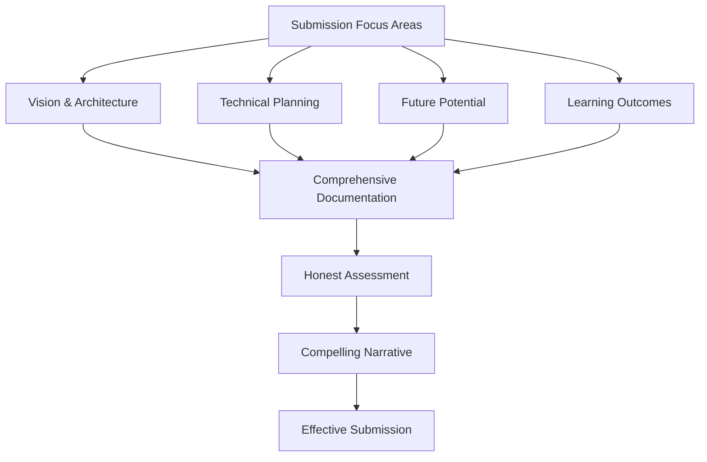

I dont <<<<<<< HEAD
# VorteX Hackathon Submission Guide

This document provides guidance on how to effectively present the VorteX project as a Soneium Hackathon submission, with a focus on highlighting the project's strengths while being transparent about its work-in-progress status.

## Submission Strategy

## Key Submission Components

### 1. Project Overview

Present a clear, concise description of VorteX that emphasizes:

- **Core Concept**: Token-gated Web3 dApp with AI agent dialogue and immersive audio
- **Unique Value**: Combination of audio immersion, character interaction, and blockchain mechanics
- **Target Audience**: Web3 explorers and audio experience seekers
- **Problem Solved**: Creating engaging, immersive token-gated experiences

Example:
> "VorteX is a token-gated Web3 experience that combines immersive audio, AI character interaction, and blockchain mechanics to create a unique digital environment. The project demonstrates how Web3 technologies can be used to create engaging, character-driven experiences that reward NFT ownership while providing rich audio-visual interaction."

### 2. Technical Architecture Highlights

Showcase the well-planned architecture:

- **Modular Design**: Highlight the clean separation of concerns
- **Technology Choices**: Explain rationale behind HTMX, Web Audio API, etc.
- **Scalability Considerations**: Emphasize how the architecture supports future growth
- **Integration Points**: Show how different technologies will work together

Use diagrams from the documentation to visually communicate the architecture.

### 3. Current Status Transparency

Be candid about the implementation status:

- **Completed Elements**: Project structure, documentation, Docker configuration
- **In-Progress Elements**: Frontend foundation, TEE DOGG agent structure, interface layer
- **Planned Elements**: HTMX integration, Web Audio implementation, blockchain integration

Refer to the [Current Status](CURRENT-STATUS.md) document for detailed breakdown.

### 4. Demo Presentation

Even with limited functionality, create an effective demo:

- **Walkthrough of Architecture**: Use diagrams to explain how components will interact
- **UI Mockups/Wireframes**: Show visual representations of the planned interface
- **Code Structure Tour**: Demonstrate the foundation that's in place
- **Documentation Highlights**: Showcase the comprehensive planning

### 5. Narrative Framing

Frame the submission as a journey:

- **Vision Development**: How the concept evolved
- **Technical Exploration**: Discoveries made during architecture planning
- **Challenge Navigation**: How technical challenges were approached
- **Future Roadmap**: Clear path forward for development

## Presentation Structure

### 1. Introduction (1-2 minutes)
- Project concept and vision
- Team introduction
- Problem statement

### 2. Architecture Overview (2-3 minutes)
- System design walkthrough
- Technology stack explanation
- Integration points

### 3. Current Implementation (1-2 minutes)
- Honest assessment of progress
- Demonstration of completed elements
- Explanation of in-progress components

### 4. Future Development (1-2 minutes)
- Roadmap highlights
- Next immediate steps
- Long-term vision

### 5. Lessons Learned (1 minute)
- Technical insights gained
- Development challenges
- Process improvements for future

### 6. Q&A Preparation (2-3 minutes)
- Anticipated questions
- Technical clarifications
- Vision elaboration

## Submission Materials Checklist

### Required Materials
- [ ] Project README (updated with accurate status)
- [ ] Comprehensive documentation in `/docs`
- [ ] Code repository with clear structure
- [ ] Brief demo video (5-7 minutes)
- [ ] Presentation slides

### Supplementary Materials
- [ ] Architecture diagrams
- [ ] User journey maps
- [ ] Technical vision document
- [ ] Development roadmap
- [ ] Current status assessment

## Addressing Common Questions

Prepare concise answers for likely questions:

### Implementation Status Questions

**Q: Why isn't feature X implemented yet?**  
A: "We prioritized architectural planning and documentation to ensure a solid foundation. Our development roadmap shows feature X scheduled for [timeframe], with the groundwork already in place through [existing components]."

**Q: How much of this is actually working?**  
A: "The current implementation includes [list working elements]. We've been transparent about the work-in-progress nature of the project, focusing on establishing a solid architecture and clear development path rather than rushing incomplete features."

### Technical Decisions Questions

**Q: Why did you choose HTMX over a framework like React?**  
A: "HTMX provides several advantages for this specific project: reduced JavaScript complexity, HTML-centric development, lightweight performance, and excellent compatibility with our audio-focused application. Our [HTMX Documentation](HTMX-DOCUMENTATION.md) details this rationale."

**Q: How will the blockchain integration actually work?**  
A: "The architecture defines clear integration points for Sequence Wallet and Startale Dice Roller. While not yet implemented, the system design accommodates these components through [specific integration mechanisms], as detailed in our [Architecture document](ARCHITECTURE.md)."

### Future Development Questions

**Q: What's your timeline for completing the project?**  
A: "Our [Roadmap](ROADMAP.md) outlines a phased approach, with core functionality targeted for completion within [timeframe]. We've prioritized features based on user impact and technical dependencies."

**Q: How will you handle [specific technical challenge]?**  
A: "We've anticipated this challenge in our technical planning. Our approach involves [specific solution], as outlined in our [Technical Vision](TECHNICAL-VISION.md) document."

## Submission Narrative Example

> "VorteX represents an exploration of how Web3 technologies, immersive audio, and character-driven interaction can create compelling digital experiences. While the current implementation is in early stages, the project demonstrates thoughtful architectural planning, clear technical vision, and a solid foundation for future development.
> 
> The comprehensive documentation and modular architecture showcase our approach to building scalable, engaging Web3 applications. We've been transparent about the work-in-progress nature of the project, focusing on establishing the right foundation rather than rushing incomplete features.
> 
> The key innovations in our approach include the audio-first design philosophy, the integration of HTMX for lightweight interactivity, and the character-driven access model through the TEE DOGG agent. These elements combine to create a unique experience that demonstrates the potential of Web3 beyond typical use cases.
> 
> Our roadmap outlines a clear path forward, with immediate next steps focused on implementing core functionality while maintaining the architectural integrity established in this foundation."

## Visual Presentation Tips

- **Use Architecture Diagrams**: Highlight the well-thought-out system design
- **Show User Journey Maps**: Illustrate the intended user experience
- **Include Status Indicators**: Clearly mark what's complete, in-progress, and planned
- **Demonstrate Structure**: Show the organized codebase and documentation
- **Present Roadmap Visually**: Use timeline visualizations from documentation

## Conclusion

The VorteX submission should emphasize the project's strong conceptual foundation, well-planned architecture, and clear development path. By being transparent about the current implementation status while highlighting the comprehensive planning and vision, the submission can effectively communicate the project's value and potential despite its work-in-progress nature.

Remember that many successful projects begin as works-in-progress, and judges often value honesty, architectural thinking, and potential as much as completed functionality. The quality of planning, documentation, and vision demonstrated in VorteX provides a strong foundation for an effective hackathon submission.
=======
>>>>>>> 5bb63e7c9fc442be8277cb937eba3615149f9b03
