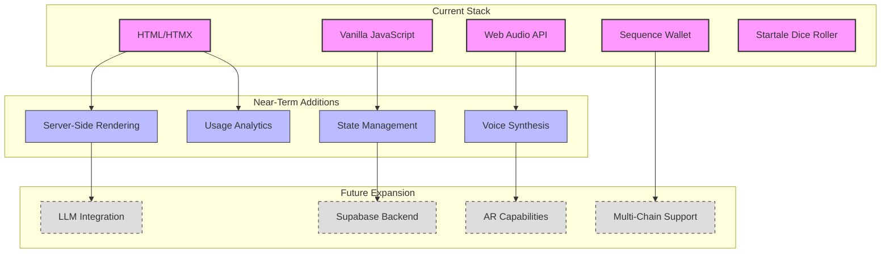

# VorteX Technical Vision

This document outlines the long-term technical vision for the VorteX project, including architectural goals, scaling considerations, and future technology integration plans.

## Core Technical Philosophy

The VorteX project is built on several key technical principles:

1. **Modular Architecture**: Clean separation of concerns with well-defined interfaces
2. **Progressive Enhancement**: Core functionality works without advanced features, enhanced when available
3. **Minimal JavaScript Footprint**: Using HTMX and targeted JS rather than heavy frameworks
4. **Immersive Experience**: Prioritizing audio and interaction quality for engagement
5. **Blockchain Integration**: Thoughtful integration of Web3 technologies without compromising UX

## Technology Stack Evolution

## HTMX Evolution Strategy

HTMX serves as a foundation for the user interface, with a planned evolution path:

### Phase 1: Basic HTMX Implementation
- Simple attribute-based interactions
- Core UI updates without page refreshes
- Basic form handling

### Phase 2: Advanced HTMX Patterns
- WebSocket integration for real-time updates
- Server-Sent Events for push notifications
- Out-of-band updates for complex UI changes

### Phase 3: HTMX + Progressive Framework
- Potential integration with lightweight frameworks where needed
- Custom extensions for project-specific needs
- Advanced state management patterns

## Audio Technology Roadmap

The Web Audio API implementation will evolve through several stages:

### Phase 1: Basic Audio Implementation
- Simple playback of pre-recorded audio
- Basic audio layering (voice, ambient, UI)
- Volume controls and muting

### Phase 2: Advanced Audio Features
- Spatial audio for immersive experience
- Dynamic mixing based on user context
- Reactive audio that responds to user actions

### Phase 3: AI-Enhanced Audio
- Voice synthesis for dynamic dialogue
- Emotion detection and responsive audio
- Personalized audio experiences

## Blockchain Integration Evolution

The Web3 components will follow this evolution path:

### Phase 1: Basic Integration
- Simple wallet connection
- Mock NFT verification
- Basic dice rolling functionality

### Phase 2: Full Integration
- Complete Sequence SDK integration
- Actual NFT ownership verification
- Startale RPC integration for verifiable randomness

### Phase 3: Advanced Web3 Features
- Multi-chain support
- NFT metadata utilization
- On-chain actions and transactions
- Marketplace integration

## Scaling Considerations

The architecture is designed with the following scaling considerations:

### User Scaling
- **Current Target**: Single-user experience
- **Near-Term Goal**: Hundreds of concurrent users
- **Long-Term Vision**: Thousands of concurrent users with consistent performance

### Feature Scaling
- **Current Focus**: Core experience with limited features
- **Near-Term Expansion**: Complete feature set with full blockchain integration
- **Long-Term Vision**: Extensible platform supporting multiple experiences

### Technical Scaling
- **Current Architecture**: Client-side with minimal backend requirements
- **Near-Term Evolution**: Introduction of lightweight backend services
- **Long-Term Architecture**: Microservices architecture with specialized components

## Performance Goals

The project has specific performance targets:

| Metric | Current | Near-Term Goal | Long-Term Target |
|--------|---------|----------------|------------------|
| Initial Load Time | < 3s | < 2s | < 1s |
| Time to Interactive | < 5s | < 3s | < 2s |
| Animation Frame Rate | 30fps | 60fps | 60fps+ |
| Audio Latency | < 100ms | < 50ms | < 20ms |
| Wallet Connection Time | < 5s | < 3s | < 2s |
| Blockchain Transaction Time | N/A | < 10s | < 5s |

## Security Roadmap

Security considerations will evolve with the project:

### Phase 1: Basic Security
- Secure wallet connection practices
- Input validation
- XSS prevention

### Phase 2: Enhanced Security
- Comprehensive input sanitization
- Rate limiting
- Transaction signing best practices

### Phase 3: Advanced Security
- Regular security audits
- Penetration testing
- Bug bounty program
- Advanced encryption for sensitive data

## Accessibility Vision

The project has a progressive accessibility roadmap:

### Phase 1: Basic Accessibility
- Semantic HTML
- Keyboard navigation
- Screen reader compatibility for core functions

### Phase 2: Enhanced Accessibility
- WCAG 2.1 AA compliance
- Alternative interaction modes
- Reduced motion options

### Phase 3: Comprehensive Accessibility
- WCAG 2.1 AAA compliance where applicable
- Customizable experience for different needs
- Alternative audio experiences

## Development Tooling Evolution

The development environment will evolve with the project:

### Phase 1: Minimal Tooling
- Simple local development setup
- Basic version control
- Manual testing

### Phase 2: Enhanced Tooling
- Automated testing framework
- CI/CD pipeline
- Code quality tools
- Documentation generation

### Phase 3: Comprehensive Tooling
- Performance monitoring
- Automated accessibility testing
- Security scanning
- Advanced analytics

## Containerization Strategy

The project has a phased containerization approach:

### Phase 1: Basic Containerization
- Single container for the entire application
- Simple deployment process

### Phase 2: Component Containerization
- Separate containers for frontend and backend
- Basic orchestration

### Phase 3: Microservices Architecture
- Fine-grained containerization of services
- Advanced orchestration with Kubernetes
- Scalable deployment across environments

## AI Integration Roadmap

The project has a vision for progressive AI integration:

### Phase 1: Rule-Based Intelligence
- Scripted dialogue and interactions
- Predetermined responses and behaviors

### Phase 2: Basic AI Integration
- Simple LLM integration for dynamic dialogue
- Basic context awareness
- Personalized responses based on user history

### Phase 3: Advanced AI Capabilities
- Multimodal AI understanding (text, audio, behavior)
- Emotional intelligence in interactions
- Adaptive experiences based on user patterns
- Generative content creation

## Data Strategy

The project's approach to data will evolve:

### Phase 1: Minimal Data Usage
- Local storage for preferences
- No persistent user data

### Phase 2: Basic Data Integration
- Optional user profiles
- Basic analytics
- Interaction history for personalization

### Phase 3: Comprehensive Data Strategy
- Advanced analytics
- AI training data collection (with consent)
- Cross-session personalization
- Data portability and user ownership

## Technical Debt Management

The project includes a strategy for managing technical debt:

1. **Regular Refactoring Cycles**: Dedicated time for code improvement
2. **Documentation Requirements**: All technical decisions documented
3. **Code Quality Metrics**: Tracking and improving code quality over time
4. **Architectural Reviews**: Regular reviews of architecture decisions

## Conclusion

The VorteX technical vision outlines a progressive path from the current foundation to a sophisticated, scalable platform. By maintaining modular architecture and clear technical principles, the project can evolve while preserving core functionality and user experience.

This vision serves as a guide for technical decisions, helping to ensure that short-term implementations align with long-term goals.
