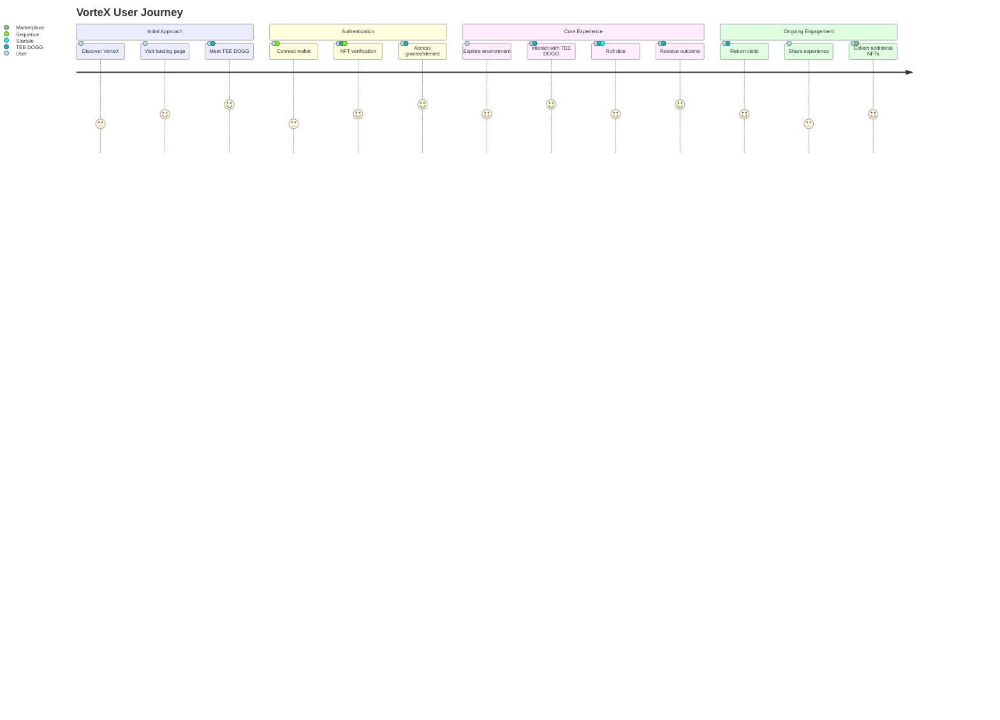
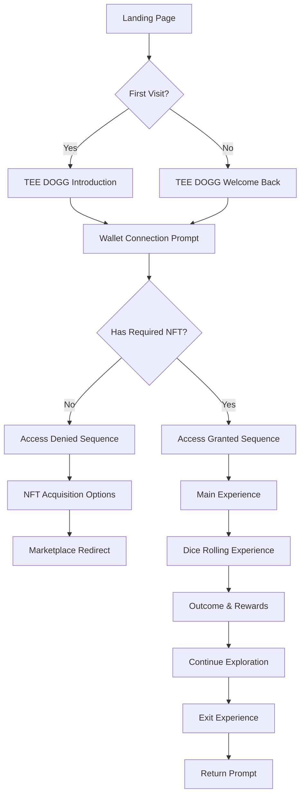
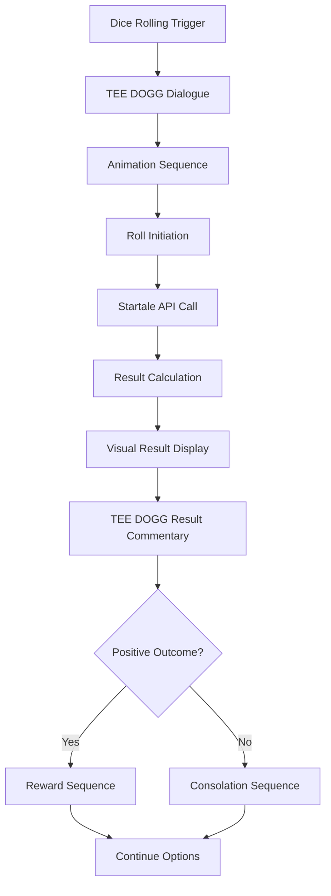

# VorteX User Experience Design

This document outlines the user experience design for the VorteX token-gated Web3 dApp, including user journeys, interaction design principles, and experience goals.

## User Journey Map

## Core Experience Principles

The VorteX experience is built on five core principles:

1. **Immersive Engagement**: Creating a captivating environment through audio, visuals, and interaction
2. **Conversational Flow**: Natural dialogue-based interactions with the TEE DOGG agent
3. **Progressive Disclosure**: Revealing features and content as users progress through the experience
4. **Rewarded Exploration**: Encouraging discovery through interactive elements and rewards
5. **Web3 Integration**: Seamlessly incorporating blockchain elements without technical friction

## User Personas

### Primary Persona: Web3 Explorer

**Profile:**
- Familiar with crypto wallets and NFTs
- Interested in novel Web3 experiences
- Values unique digital interactions
- Appreciates audio and visual quality

**Goals:**
- Discover new and engaging Web3 applications
- Experience innovative uses of NFTs
- Connect with digital characters and environments
- Share interesting discoveries with community

**Pain Points:**
- Frustrated by technical barriers in Web3
- Dislikes repetitive or shallow experiences
- Wary of projects with poor UX despite good concepts

### Secondary Persona: Audio Experience Seeker

**Profile:**
- Prioritizes audio quality and immersion
- May be new to Web3 concepts
- Drawn to character-driven experiences
- Values narrative and atmosphere

**Goals:**
- Find audio-rich digital experiences
- Interact with compelling characters
- Enjoy ambient and responsive sound design
- Discover new forms of digital entertainment

**Pain Points:**
- Disappointed by experiences with poor audio
- Confused by complex Web3 onboarding
- Frustrated by technical jargon

## Interaction Design Framework

### Audio-First Interaction

The VorteX experience prioritizes audio as a primary interaction channel:

1. **Layered Audio Design**:
   - Character voice (TEE DOGG)
   - Ambient environment sounds
   - UI feedback sounds
   - Music and mood elements

2. **Audio Responsiveness**:
   - Sounds react to user actions
   - Audio cues guide user attention
   - Spatial audio indicates direction and focus

3. **Voice Interaction**:
   - TEE DOGG's voice as primary narrative element
   - Tone and delivery convey context and emotion
   - Voice characteristics reinforce character identity

### Visual Support Framework

Visual elements complement the audio experience:

1. **Minimalist Interface**:
   - Clean, focused UI elements
   - Visual reinforcement of audio cues
   - Atmospheric visual design

2. **Character Presence**:
   - TEE DOGG visual representation
   - Expressive character animations
   - Visual feedback for interactions

3. **Environmental Design**:
   - Cohesive visual atmosphere
   - Interactive elements highlighted
   - Progressive visual revelation

### Conversation Design

The TEE DOGG interaction follows conversation design principles:

1. **Personality Consistency**:
   - Defined character voice and mannerisms
   - Consistent response patterns
   - Recognizable phrases and expressions

2. **Contextual Awareness**:
   - Responses appropriate to user's progress
   - Memory of previous interactions
   - Adaptation to user behavior

3. **Conversation Flow**:
   - Natural dialogue progression
   - Appropriate pauses and timing
   - Conversational repair mechanisms

## User Flow Diagrams

### Main Access Flow

### Dice Rolling Interaction Flow

## Experience States

The VorteX experience has several key states:

### 1. Approach State
- First impression and introduction
- TEE DOGG initial greeting
- Establishing atmosphere and expectations

### 2. Authentication State
- Wallet connection process
- NFT verification
- Access determination

### 3. Exploration State
- Environment discovery
- TEE DOGG interaction
- Feature discovery

### 4. Engagement State
- Dice rolling interaction
- Outcome determination
- Reward/consequence delivery

### 5. Return State
- Recognition of returning users
- Progress acknowledgment
- New content/feature introduction

## Accessibility Considerations

The VorteX experience is designed with the following accessibility considerations:

### Audio Experience
- Volume controls for different audio layers
- Text alternatives for critical audio content
- Visual indicators for important audio cues

### Visual Experience
- High contrast interface elements
- Scalable text and UI components
- Alternative navigation options

### Interaction Design
- Multiple interaction methods (click, keyboard, etc.)
- Adjustable timing for time-sensitive interactions
- Clear feedback for all user actions

## Feedback Integration Framework

The user experience will continuously improve through structured feedback:

### Feedback Collection Points
- Post-authentication feedback
- Post-dice roll feedback
- Exit experience feedback

### Feedback Categories
- Audio quality and effectiveness
- Interaction satisfaction
- TEE DOGG character engagement
- Technical performance
- Overall experience rating

### Feedback Implementation Process
1. Collection through in-experience prompts
2. Analysis and prioritization
3. Design adjustments based on patterns
4. Implementation in iterative releases
5. Validation through follow-up metrics

## Experience Metrics

The VorteX experience will be measured using the following metrics:

### Engagement Metrics
- Time spent in experience
- Interaction frequency
- Return rate
- Feature discovery percentage

### Satisfaction Metrics
- Explicit feedback ratings
- Completion rate
- Recommendation rate
- Social sharing actions

### Technical Metrics
- Load time performance
- Interaction responsiveness
- Error frequency
- Device compatibility

## Future Experience Enhancements

The user experience roadmap includes:

### Phase 1: Core Experience
- Basic TEE DOGG interaction
- Simple dice rolling mechanic
- Fundamental audio implementation
- Basic wallet connection

### Phase 2: Enhanced Engagement
- Expanded TEE DOGG dialogue options
- More complex dice rolling outcomes
- Enhanced audio layering
- Improved visual feedback

### Phase 3: Advanced Experience
- Dynamic TEE DOGG personality
- Complex game mechanics
- Fully immersive audio environment
- Personalized user experiences
- Multi-user interaction capabilities

## Conclusion

The VorteX user experience design creates an immersive, audio-first interaction with the TEE DOGG character at its center. By focusing on conversational flow, progressive disclosure, and seamless Web3 integration, the experience aims to engage users through a unique combination of character interaction, ambient audio, and blockchain-enabled features.

This design framework serves as a guide for implementation, ensuring that all components work together to create a cohesive and compelling user experience.
